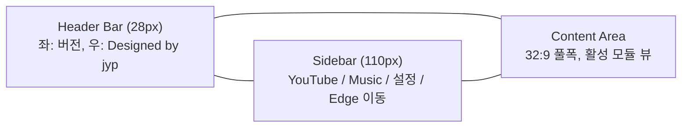

# EdgeLauncher 사용 가이드

Corsair Xeneon Edge(2560x720, 32:9, 멀티터치) 디스플레이를 위한 macOS 네이티브 런처. 좌측 사이드바에서 탭을 골라 32:9 풀폭으로 콘텐츠를 즐긴다.

---

## 빠른 시작

1. `make install run` 또는 Xcode 에서 Cmd+R
2. 메인 윈도우가 뜨면 사이드바에서 YouTube 또는 Music 탭 선택
3. Xeneon Edge 가 연결되어 있으면 사이드바 하단 ⇨ 버튼으로 Edge 화면으로 이동
4. 풀스크린은 Ctrl+Cmd+F 또는 윈도우 좌상단 초록 버튼

---

## UI 구조



| 영역 | 폭/높이 | 역할 |
|---|---|---|
| Header Bar | 전체 폭 × 28 px | 앱 이름, 버전, 디자이너 표기 |
| Sidebar | 110 px × 나머지 높이 | 탭 전환, 설정, Edge 이동 |
| Content | 나머지 폭 × 나머지 높이 | 활성 탭의 모듈 뷰 |

---

## 탭별 사용법

### YouTube

- 좌측 사이드바에서 ▶ 아이콘 클릭
- WKWebView 로 `youtube.com` 임베드
- 로그인 정보는 쿠키 영속화로 유지
- **터치 제스처**: 영상 좌/우 더블탭 = 10초 점프
- **풀스크린**: 영상 우하단 풀스크린 버튼 또는 키보드 F

### Music

- 좌측 사이드바에서 ♪ 아이콘 클릭
- `music.youtube.com` 임베드
- 키보드 미디어 키(재생/일시정지/다음/이전) 연동
- macOS 제어센터의 Now Playing 위젯에 현재 곡 표시 (WebKit MediaSession 기본 동작)

### 설정

- 사이드바 하단 ⚙ 아이콘 또는 Cmd+, 단축키
- **앱 실행 시 Xeneon Edge로 자동 이동** — 부팅 시 윈도우를 Edge 화면으로 자동 이동
- **Edge 이동 시 자동 풀스크린** — 이동 후 자동으로 풀스크린 진입

---

## Xeneon Edge 디스플레이 감지

`XeneonDisplayService` 가 macOS 의 `NSScreen` 을 감시하며 해상도가 2560 × 720 ±4 px 인 화면을 Edge 로 식별한다. 디스플레이가 연결되거나 해제될 때마다 자동으로 갱신된다.

| 상태 | 사이드바 ⇨ 버튼 |
|---|---|
| Edge 연결됨 | 활성 (클릭 시 윈도우 이동) |
| Edge 미연결 | 비활성 (회색) |

---

## 단축키

| 키 | 동작 | 라우팅 |
|---|---|---|
| Cmd+1..9 | 탭 전환 (활성 모듈이 처리하지 않을 시 default) | `CommandRouter` global default |
| Cmd+N | 활성 모듈에 "새 항목" 명령 | `ModuleCommand.newItem` |
| Cmd+E | 활성 모듈에 "편집" 명령 | `ModuleCommand.editItem` |
| Cmd+Delete | 활성 모듈에 "삭제" 명령 | `ModuleCommand.delete` |
| Cmd+F | 활성 모듈에 "검색" 명령 | `ModuleCommand.search` |
| Cmd+R | 활성 모듈 + 시스템 새로고침 | `ModuleCommand.refresh` |
| Cmd+, | 설정 윈도우 | macOS 기본 |
| Ctrl+Cmd+F | 풀스크린 토글 | macOS 기본 |
| Cmd+W | 윈도우 닫기 | macOS 기본 |
| Cmd+Q | 앱 종료 | macOS 기본 |

영상/음악 컨트롤은 키보드 미디어 키(F7/F8/F9 또는 Touch Bar) 사용.

`CommandRouter` 는 활성 모듈에 먼저 dispatch 하고, 처리되지 않으면 global default 로 fallback 한다. 모듈은 `EdgeModule.commandHandler` 를 반환해 명령을 받는다.

---

## 모듈 추가 (개발자용)

새 탭을 추가하려면:

1. `EdgeLauncher/Modules/<Name>/` 디렉토리 생성
2. `<Name>View.swift` (SwiftUI View) 작성 — ViewModel/Service 는 모듈이 소유, View 에 주입
3. `<Name>Module.swift` 에서 `EdgeModule` 프로토콜 구현
   - 필요 시 `commandHandler: ModuleCommandHandler?` 반환
   - 필요 시 `requiredPermissions: [PermissionKind]` 반환
4. `EdgeLauncher/App/AppEnvironment.swift` 의 `init()` 에 `registry.register(AnyEdgeModule(<Name>Module()))` 한 줄 추가

`PBXFileSystemSynchronizedRootGroup` 덕에 디스크에 파일만 두면 Xcode 가 자동 인식한다.

### 공통 인프라

| 컴포넌트 | 위치 | 용도 |
|---|---|---|
| `CommandRouter` | `Core/Command/` | 활성 모듈 기반 키보드 단축키 라우팅 |
| `PermissionService` | `Core/Permission/` | Calendar/Accessibility/Automation 권한 상태 통합 |
| `AtomicJSONStore<T>` | `Core/Persistence/` | crash-safe JSON 영속화 (temp+rename, 백업 회전, 스키마 버전, debounce) |
| `PermissionPromptView` | `Core/Permission/` | 권한 거부/미요청 상태의 onboarding UI |

### Info.plist 키 추가

`GENERATE_INFOPLIST_FILE = YES` 빌드 설정 사용 중. 권한 설명·URL scheme 은 `INFOPLIST_KEY_*` build setting 으로 주입.
자세한 사용법은 [`EdgeLauncher/Core/Build/InfoPlistRecipes.md`](EdgeLauncher/Core/Build/InfoPlistRecipes.md) 참조.

---

## 트러블슈팅

### YouTube/Music 페이지가 비어있다

App Sandbox 네트워크 권한 문제일 가능성. [INSTALL.md](INSTALL.md#app-sandbox-네트워크-차단) 참조.

### 로그인이 매번 풀린다

`WKWebsiteDataStore.default()` 의 쿠키가 macOS 사용자 데이터 디렉토리에 저장된다. 다음 위치에서 확인:

```bash
ls ~/Library/Containers/com.jyp.EdgeLauncher/Data/Library/WebKit/
```

이 디렉토리가 매번 삭제되면 (예: 권한 이슈) 로그인이 풀린다.

### 더블탭 점프가 안 된다

- Xeneon Edge 의 터치 패널이 정상 인식되는지 확인 (Edge 의 USB-C 단자 양쪽 모두 연결)
- 영상이 재생 중일 때만 동작 (정지 상태에서는 currentTime 조정 안 됨)
- 350 ms 안에 두 번, 좌우 60 px 이내 동일 위치 탭

### 미디어 키가 동작하지 않는다

YouTube Music 의 MediaSession API 가 WebKit 에서 활성화되어야 한다. macOS 13.4 이상이 필요. 활성화 확인:

1. Music 탭에서 곡 재생
2. 제어센터 (메뉴바 오른쪽) 클릭 → Now Playing 위젯에 곡 정보가 보이면 정상
3. 안 보이면 [디자인 문서의 미해결 사항](docs/superpowers/specs/2026-05-15-xeneon-edge-launcher-design.md#14-미해결-사항) 참조. follow-up 으로 MPRemoteCommandCenter 브리지를 추가할 수 있다.

### 윈도우가 Edge 로 이동 후 깨진다

처음 macOS 가 Edge 와 메인 모니터의 색공간/스케일을 다르게 처리하면 윈도우 콘텐츠가 깜빡일 수 있다. **풀스크린 한 번 토글**로 해결.

---

## 로드맵 (Phase 2)

선택된 카테고리는 [디자인 spec](docs/superpowers/specs/2026-05-15-xeneon-edge-launcher-design.md#6-phase-2-모듈-선정된-카테고리) 의 5개 모듈. MVP 검수 후 우선순위 재조정.

| 모듈 | 특징 |
|---|---|
| 시스템 모니터 | CPU/GPU/RAM/네트워크 가로 시계열 |
| 위젯 대시보드 | 시계, 날씨, 캘린더, 할일 가로 배치 |
| 메신저 사이드 패널 | Slack/Discord/iMessage/Mail 통합 |
| 런처 | 클립보드 히스토리, AI 채팅 |
| 앰비언트 | 디지털 액자, 풀스크린 시계, 비주얼라이저 |

---

## 관련 문서

- [README.md](README.md) — 개요와 구조
- [INSTALL.md](INSTALL.md) — 설치, 트러블슈팅
- [docs/superpowers/specs/2026-05-15-xeneon-edge-launcher-design.md](docs/superpowers/specs/2026-05-15-xeneon-edge-launcher-design.md) — 디자인 spec
- [docs/superpowers/plans/2026-05-15-xeneon-edge-launcher.md](docs/superpowers/plans/2026-05-15-xeneon-edge-launcher.md) — 구현 plan
