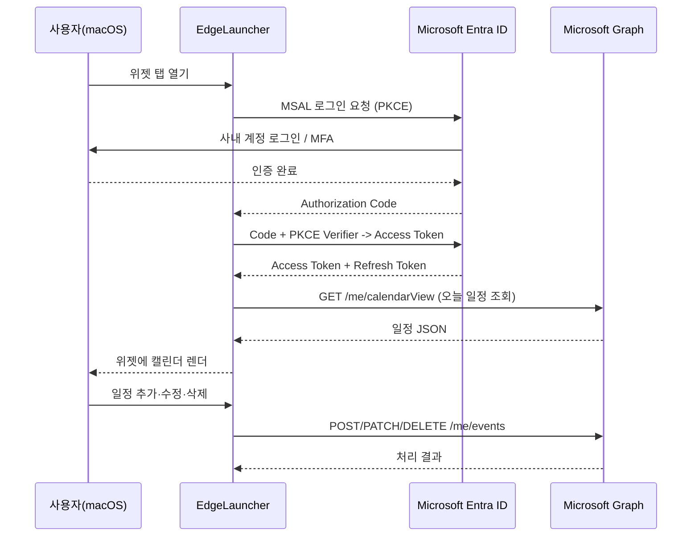

# Azure AD 앱 등록 요청서

**요청자**: 박종영 (eungkkokuso@naver.com)
**요청일**: 2026-05-15
**대상**: 인프라팀
**용도**: EdgeLauncher 데스크톱 앱의 MS 365 캘린더(Outlook) 연동

---

## 1. 요청 배경

사내 macOS 데스크톱 런처 `EdgeLauncher` 의 위젯 탭에서 개인 업무용 MS 365 캘린더(Outlook)를 조회·표시하기 위해 Microsoft Graph API 호출이 필요합니다. Graph API 호출을 위해서는 Azure AD(Microsoft Entra ID) 테넌트에 앱 등록 및 권한 동의가 선행되어야 하므로, 인프라팀 측 등록·승인을 요청드립니다.

## 2. 요청 항목 요약

| 항목 | 요청 내용 |
|---|---|
| 앱 등록(App Registration) | 신규 생성 |
| 앱 이름 | `EdgeLauncher-Calendar` (변경 가능) |
| 앱 유형 | Public client / Native (모바일·데스크톱) |
| 지원 계정 유형 | 단일 테넌트 (사내 계정만) |
| 인증 방식 | OAuth 2.0 Authorization Code + PKCE (MSAL) |
| Client Secret | **불필요** (Public client 이므로 발급 금지) |
| Redirect URI | `msauth.com.jyp.EdgeLauncher://auth` (Custom URI scheme) |
| 필요 API | Microsoft Graph |
| 필요 권한(Delegated) | `User.Read`, `Calendars.ReadWrite`, `Calendars.ReadWrite.Shared`, `offline_access` |
| 관리자 동의 | 필요 시 부여 (`Calendars.ReadWrite.Shared` 는 테넌트 정책에 따라 관리자 동의가 요구될 수 있음) |
| 이용 대상 | 요청자 본인 계정 1건 (시범 사용 후 확대 시 별도 요청) |

## 3. 사용 시나리오

- 토큰은 macOS Keychain 에 저장하며, 앱 외부로 송신하지 않습니다.
- 외부 서버를 경유하지 않고 사용자 디바이스에서 직접 Graph API 를 호출합니다.

## 4. 요청 권한 상세

| Scope | 종류 | 사용 목적 |
|---|---|---|
| `User.Read` | Delegated | 로그인 사용자 기본 정보 확인 (이름, 이메일) |
| `Calendars.ReadWrite` | Delegated | 내 캘린더 일정 읽기·생성·수정·삭제 |
| `Calendars.ReadWrite.Shared` | Delegated | 다른 사용자가 나에게 공유·위임한 캘린더 일정 읽기·생성·수정·삭제 |
| `offline_access` | Delegated | Refresh Token 발급으로 재로그인 부담 감소 |

- 본인 및 **본인에게 공유된 캘린더 한정**으로 읽기·쓰기 권한을 요청합니다. 테넌트 전체 캘린더 접근(`Calendars.ReadWrite.All`) 권한은 요청하지 않습니다.
- 메일(`Mail.*`), 파일(`Files.*`), 디렉터리(`Directory.*`) 등 다른 권한은 요청하지 않습니다.

## 5. 보안 고려 사항

| 항목 | 내용 |
|---|---|
| 토큰 저장 위치 | macOS Keychain (Apple keychain-access-groups) |
| 평문 자격증명 저장 | 없음 (사용자 비밀번호는 앱이 보지 않음, MS 로그인 페이지 사용) |
| Client Secret | 사용 안 함 (Public client + PKCE) |
| 토큰 전송 | HTTPS 만 사용, MS 엔드포인트로 직접 전송 |
| 로그 출력 | Access Token 은 로그에 출력하지 않음 (마스킹) |
| 미사용 시 | 사용자가 로그아웃하면 Keychain 항목 즉시 삭제 |

## 6. 인프라팀에 부탁드리는 사항

1. Azure Portal 또는 Entra 관리 콘솔에서 위 사양으로 앱 등록 생성
2. 아래 정보 회신
   - **Application (client) ID**
   - **Directory (tenant) ID**
   - 등록 완료된 Redirect URI 확인
3. `Calendars.Read` 권한이 사용자 동의로 충분한지, 관리자 동의가 필요한지 확인 후 안내
4. 등록 정책상 앱 이름·Redirect URI 형식 변경이 필요하면 가이드 회신

회신받은 Client ID / Tenant ID 는 EdgeLauncher 빌드 설정에 주입하며, 평문 비밀번호·Secret 은 포함되지 않습니다.

## 7. 일정·범위

| 항목 | 내용 |
|---|---|
| 시범 사용 기간 | 등록 후 2주 내 동작 검증 |
| 사용 인원 | 요청자 본인 1명 (확대 필요 시 별도 요청) |
| 종료·회수 시 | 인프라팀이 언제든 앱 등록 비활성화·삭제 가능 |

## 8. 참고 링크

- Microsoft Graph - Calendar API: https://learn.microsoft.com/graph/api/resources/calendar
- MSAL for macOS/iOS: https://learn.microsoft.com/entra/identity-platform/msal-overview
- Public client + PKCE: https://learn.microsoft.com/entra/identity-platform/v2-oauth2-auth-code-flow

---

문의 회신은 eungkkokuso@naver.com 또는 사내 메신저로 부탁드립니다.
