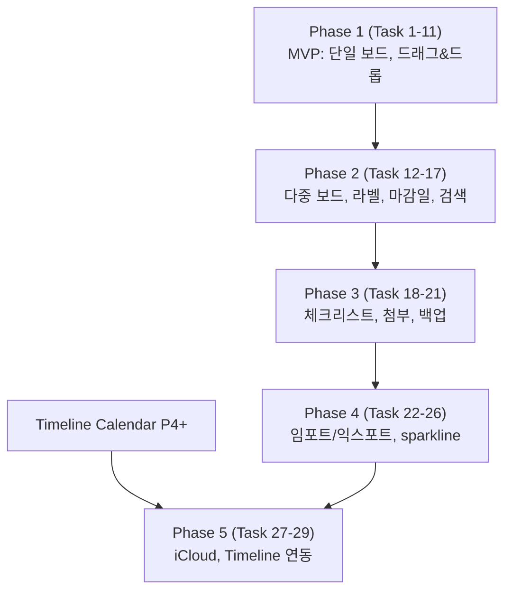

# Kanban Board Implementation Plan

> **For agentic workers:** REQUIRED SUB-SKILL: Use superpowers:subagent-driven-development (recommended) or superpowers:executing-plans to implement this plan task-by-task. Steps use checkbox (`- [ ]`) syntax for tracking.

**Goal:** 32:9 와이드 디스플레이에 4~6 컬럼 칸반 보드를 가로로 펼친다. 멀티터치 드래그&드롭으로 카드 이동, 다중 보드, 라벨·마감일·체크리스트·검색, 휴지통+undo, 로컬 JSON 영속, Trello/Markdown 임포트.

**Architecture:** `KanbanModule (EdgeModule)` → `KanbanBoardView` → `KanbanViewModel (@Observable)` → `KanbanStore` (보드 단위 JSON). 카드 검색은 in-memory full-text. Undo 는 `UndoManager` 직접 사용. 드래그&드롭은 `Transferable` + `.draggable`/`.dropDestination`.

**Tech Stack:** Swift 5.9, SwiftUI 5+ (`Transferable`), AppKit (NSPanGestureRecognizer for swipe), Foundation `FileManager`, XCTest. macOS 14+ 유지. 외부 SPM 없음.

**Spec:** `docs/superpowers/specs/2026-05-15-kanban-spec.md`
**선행 의존성:** `docs/superpowers/plans/2026-05-15-module-infrastructure.md` Phase 1~4 완료 후 시작.

---

## Codex Review Corrections (2026-05-15)

| 영역 | 원본 | 수정 |
|---|---|---|
| Transferable payload (Task 6) | 전체 `KanbanCard` 인스턴스 | **`KanbanCardRef { cardId, boardId, sourceColumnId }`** 만 — stale write + duplicate id 방지. 실제 카드는 store 에서 lookup |
| 드래그&드롭 (Task 6) | SwiftUI `.draggable` / `.dropDestination` 단독 | 32:9 외부 터치에서 long-press drag 보장 안 됨. AppKit `NSPanGestureRecognizer` fallback 레이어 추가 |
| UndoManager (Task 8) | "직접 사용" | SwiftUI environment undoManager 는 VM 에서 직접 접근 불가. `UndoActionLog` (자체 stack) 또는 NSResponder chain 위로 wire |
| Trash + Undo 위치 (Task 8) | P1 포함 | **P3 로 강등** (spec 과 일치). P1 은 삭제 확인 alert 만. drag/drop 저장 안정성과 atomic store 가 P1 핵심 |
| Store atomicity (Task 2) | 단순 JSON write | 인프라 plan 의 `AtomicJSONStore<KanbanBoard>` 사용. `boards.json` 도 동일 store. 절대 desync 안 됨 |
| @Observable | `@Observable` 사용 명시 | 유지. 단 ADR 따라 `@Published` 사용 절대 금지 (인프라 plan) |
| 컬럼 폭 (Task 4) | 380pt 고정 | 활성 컬럼 개수 기준 responsive: `min(380, (contentWidth - spacing*(n+1)) / n)`. 6컬럼 + spacing 도 2370pt 안에 |
| 단축키 (Task 9) | `EdgeLauncherApp.swift` 직접 | 인프라 plan 의 `CommandRouter` 위임. `.newItem / .editItem / .delete / .undo / .slot1..9` |
| 검색 인덱스 (Task 16) | "in-memory" 만 | 전략 명시: card mutation 시 incremental update (add/remove/modify hook). 보드 전환 시 lazy rebuild |
| Timeline 연동 (Phase 5) | Kanban 파일 직접 읽기 | `SharedDueDateModel` (양쪽 모듈 의존 read-only 공유 모델) |
| 버전 bump | P1=0.5.0 또는 0.6.0 | **P1=0.5.0** (인프라=0.3.0, Timeline=0.4.0 다음) |

---

## File Structure

```
EdgeLauncher/
├── Modules/
│   └── Kanban/
│       ├── KanbanModule.swift                          # 신규: EdgeModule
│       ├── KanbanBoardView.swift                       # 신규: 루트 뷰
│       ├── KanbanViewModel.swift                       # 신규: @Observable
│       ├── Views/
│       │   ├── BoardHeaderView.swift                   # 신규: 보드 선택, 새 카드, 검색, 필터
│       │   ├── ColumnView.swift                        # 신규: 단일 컬럼
│       │   ├── ColumnHeaderView.swift                  # 신규: 컬럼 제목 + WIP + 메뉴
│       │   ├── CardView.swift                          # 신규: 단일 카드
│       │   ├── CardDetailPanel.swift                   # 신규: 우측 슬라이드 (제목·노트·체크리스트)
│       │   ├── CardEditorSheet.swift                   # 신규: 신규/편집 모달
│       │   ├── LabelManagerSheet.swift                 # 신규: 보드 라벨 CRUD
│       │   ├── BoardPickerView.swift                   # 신규: 보드 전환 드롭다운
│       │   ├── BoardEditorSheet.swift                  # 신규: 보드 생성/이름·색상 편집
│       │   ├── FilterBarView.swift                     # 신규: 라벨/날짜/담당자 필터
│       │   ├── SearchBarView.swift                     # 신규
│       │   ├── ChecklistView.swift                     # 신규
│       │   ├── EmptyBoardView.swift                    # 신규
│       │   └── SparklineCardView.swift                 # 신규: 7일 변화 미니 차트
│       ├── Model/
│       │   ├── KanbanBoard.swift                       # 신규
│       │   ├── KanbanColumn.swift                      # 신규
│       │   ├── KanbanCard.swift                        # 신규
│       │   ├── KanbanLabel.swift                       # 신규
│       │   ├── ChecklistItem.swift                     # 신규
│       │   └── Attachment.swift                        # 신규
│       ├── Store/
│       │   ├── KanbanStore.swift                       # 신규: JSON CRUD
│       │   ├── BoardIndex.swift                        # 신규: boards.json 메타
│       │   ├── TrashStore.swift                        # 신규: 휴지통
│       │   ├── BackupService.swift                     # 신규: 일일 스냅샷
│       │   └── KanbanMigrator.swift                    # 신규
│       ├── Search/
│       │   ├── CardSearchIndex.swift                   # 신규: in-memory full-text
│       │   └── CardFilter.swift                        # 신규: 라벨/날짜/담당자
│       ├── Import/
│       │   ├── TrelloImporter.swift                    # 신규
│       │   ├── MarkdownImporter.swift                  # 신규
│       │   └── CSVImporter.swift                       # 신규
│       └── Export/
│           ├── JSONExporter.swift                      # 신규
│           ├── MarkdownExporter.swift                  # 신규
│           └── CSVExporter.swift                       # 신규
├── App/
│   └── AppEnvironment.swift                            # 수정: KanbanModule 등록
└── EdgeLauncherTests/
    ├── KanbanStoreTests.swift                          # 신규
    ├── KanbanViewModelTests.swift                      # 신규
    ├── CardFilterTests.swift                           # 신규
    ├── CardSearchIndexTests.swift                      # 신규
    ├── TrelloImporterTests.swift                       # 신규
    ├── MarkdownImporterTests.swift                     # 신규
    ├── TrashStoreTests.swift                           # 신규
    └── KanbanMigratorTests.swift                       # 신규
```

---

# Phase 1 — MVP (단일 보드, CRUD, 드래그&드롭)

## Task 1: 도메인 모델

**Files:**
- Create: `Modules/Kanban/Model/*` (6 파일)

- [ ] **Step 1: KanbanBoard / Column / Card / Label / ChecklistItem / Attachment** — Spec 의 3절 그대로. `Codable`, `Identifiable`, `Hashable`.
- [ ] **Step 2: KanbanCard 의 `Transferable` 채택** — drag&drop 용 `ProxyRepresentation`.
- [ ] **Step 3: 빌드 검증.**
- [ ] **Step 4: Commit** — `feat(kanban): add domain models`

---

## Task 2: KanbanStore + BoardIndex

**Files:**
- Create: `Modules/Kanban/Store/KanbanStore.swift`
- Create: `Modules/Kanban/Store/BoardIndex.swift`
- Create: `EdgeLauncherTests/KanbanStoreTests.swift`

- [ ] **Step 1: 디렉토리 구조** — `~/Library/Application Support/EdgeLauncher/kanban/<boardId>.json` + `boards.json` 인덱스.
- [ ] **Step 2: 보드 CRUD** — load all (인덱스만), load board (전체), save (debounce 800ms).
- [ ] **Step 3: 컬럼/카드 CRUD 메서드** — addCard, moveCard, deleteCard, updateCard, reorderColumns.
- [ ] **Step 4: 기본 보드 시드** — 최초 로드 시 빈 보드 "기본" + 5 컬럼 (TODO/Doing/Review/Blocked/Done) 생성.
- [ ] **Step 5: 단위 테스트** — CRUD, save/load 라운드트립, 컬럼 간 이동, 손상 파일 복구.
- [ ] **Step 6: Commit** — `feat(kanban): JSON store with board index`

---

## Task 3: KanbanModule + KanbanBoardView 스켈레톤

**Files:**
- Create: `Modules/Kanban/KanbanModule.swift`
- Create: `Modules/Kanban/KanbanBoardView.swift`
- Create: `Modules/Kanban/KanbanViewModel.swift`
- Modify: `App/AppEnvironment.swift`

- [ ] **Step 1: 모듈 등록** — `id="kanban"`, `title="Kanban"`, `iconName="rectangle.split.3x1.fill"`, `supportsFullscreen=true`.
- [ ] **Step 2: ViewModel** — `@Observable`, store 주입, activeBoardId, columns (활성 보드), 검색어, 필터 상태.
- [ ] **Step 3: View placeholder** — "Kanban" 텍스트만.
- [ ] **Step 4: 화면 확인.**
- [ ] **Step 5: Commit** — `feat(kanban): register module skeleton`

---

## Task 4: ColumnView + CardView 렌더링

**Files:**
- Create: `Modules/Kanban/Views/ColumnView.swift`
- Create: `Modules/Kanban/Views/ColumnHeaderView.swift`
- Create: `Modules/Kanban/Views/CardView.swift`

- [ ] **Step 1: KanbanBoardView 가 HStack 으로 컬럼 가로 배치** — 컬럼 폭 380pt (가변).
- [ ] **Step 2: ColumnHeaderView** — 이름 + 카드 개수 + 메뉴(⋯).
- [ ] **Step 3: ColumnView** — 헤더 + `ScrollView` 안에 카드 LazyVStack.
- [ ] **Step 4: CardView** — 제목, 라벨 색 스트라이프 (라벨 첫 색), 마감일 칩 (있을 때만), 진행률 mini bar (체크리스트 있을 때만).
- [ ] **Step 5: 더미 데이터로 화면 확인** — 5개 컬럼, 각 컬럼 3개 카드.
- [ ] **Step 6: Commit** — `feat(kanban): render columns and cards`

---

## Task 5: CardEditorSheet (생성·편집)

**Files:**
- Create: `Modules/Kanban/Views/CardEditorSheet.swift`

- [ ] **Step 1: 폼** — 제목 (필수), 노트 (markdown textarea), 라벨 (멀티 picker), 마감일 (date picker, 옵션), 담당자 (텍스트).
- [ ] **Step 2: 신규 카드** — 컬럼 헤더 + 버튼 또는 빈 영역 길게 누름 → 시트.
- [ ] **Step 3: 편집** — 카드 탭 → 상세 패널의 편집 버튼 → 시트.
- [ ] **Step 4: validation** — 제목 비어있으면 저장 disable.
- [ ] **Step 5: Commit** — `feat(kanban): card editor sheet`

---

## Task 6: 드래그&드롭 (컬럼 간 이동, 컬럼 내 순서)

**Files:**
- Modify: `CardView.swift`, `ColumnView.swift`, `KanbanViewModel.swift`

- [ ] **Step 1: CardView 에 `.draggable(card)`.**
- [ ] **Step 2: ColumnView 의 카드 LazyVStack 위·아래·사이에 dropDestination** — drop position 계산 (인덱스).
- [ ] **Step 3: ViewModel.moveCard(cardId:, toColumn:, toIndex:)** — store 업데이트.
- [ ] **Step 4: 드래그 중 미리보기** — 카드 반투명 + 그림자.
- [ ] **Step 5: 드롭 위치 표시** — 라인 인디케이터.
- [ ] **Step 6: 화면 확인 (마우스 + 터치).**
- [ ] **Step 7: Commit** — `feat(kanban): drag and drop cards`

---

## Task 7: CardDetailPanel + 인라인 편집

**Files:**
- Create: `Modules/Kanban/Views/CardDetailPanel.swift`

- [ ] **Step 1: 카드 탭 → 우측 360pt 슬라이드 인.**
- [ ] **Step 2: 표시** — 제목 (인라인 편집), 라벨, 마감일, 담당자, 노트 (markdown 렌더 + 편집 토글), 체크리스트 (P3 자리).
- [ ] **Step 3: 액션** — 편집 시트 열기, 삭제, 색상 변경, 컬럼 이동 picker.
- [ ] **Step 4: ESC 닫기, 카드 외 클릭으로도 닫기.**
- [ ] **Step 5: Commit** — `feat(kanban): card detail panel`

---

## Task 8: 삭제 + 휴지통 + undo

**Files:**
- Create: `Modules/Kanban/Store/TrashStore.swift`
- Modify: `KanbanViewModel.swift`

- [ ] **Step 1: TrashStore** — `kanban/.trash/<boardId>/<cardId>.json`. 30일 후 자동 삭제 (모듈 활성화 시 sweep).
- [ ] **Step 2: deleteCard** — TrashStore 로 이동 후 viewModel 에서 제거.
- [ ] **Step 3: UndoManager 통합** — Cmd+Z 로 카드 복원, Shift+Cmd+Z redo.
- [ ] **Step 4: 토스트 "카드 삭제됨 · 실행 취소"** — 10초.
- [ ] **Step 5: 단위 테스트.**
- [ ] **Step 6: Commit** — `feat(kanban): delete with trash and undo`

---

## Task 9: BoardHeaderView + 단축키

**Files:**
- Create: `Modules/Kanban/Views/BoardHeaderView.swift`

- [ ] **Step 1: 헤더** — 보드 이름 (P2 에서 picker 로 확장) + 새 카드 버튼.
- [ ] **Step 2: 단축키** — Cmd+N (새 카드, 활성 컬럼 또는 첫 컬럼), Cmd+E (선택 카드 편집), Cmd+Delete (삭제), Cmd+Z (undo).
- [ ] **Step 3: 키보드 카드 포커스** — 방향키로 카드 포커스 이동, Enter 로 상세 패널 열기.
- [ ] **Step 4: Commit** — `feat(kanban): header and keyboard shortcuts`

---

## Task 10: lifecycle + 자동 저장 검증

**Files:**
- Modify: `KanbanModule.swift`

- [ ] **Step 1: didBecomeActive** — store 로드, 휴지통 sweep.
- [ ] **Step 2: didResignActive** — 진행 중 편집 flush, undo manager 비우기.
- [ ] **Step 3: debounce 저장 정상 동작 확인 (Instruments).**
- [ ] **Step 4: Commit** — `feat(kanban): module lifecycle`

---

## Task 11: P1 통합 + 문서

- [ ] **Step 1: 회귀 점검.**
- [ ] **Step 2: README/GUIDE 에 Kanban 섹션 추가.**
- [ ] **Step 3: 버전 0.5.0 bump (StreamDeck 와 충돌 시 0.6.0), CHANGELOG.**
- [ ] **Step 4: Commit** — `docs(kanban): phase 1 release notes`

---

# Phase 2 — 다중 보드 + 라벨 + 마감일 + 검색

## Task 12: 다중 보드 + BoardPicker

**Files:**
- Create: `Modules/Kanban/Views/BoardPickerView.swift`
- Create: `Modules/Kanban/Views/BoardEditorSheet.swift`

- [ ] **Step 1: BoardPicker 드롭다운** — 보드 목록 + 새 보드 + 이름 편집·삭제.
- [ ] **Step 2: 단축키** — Cmd+1..9 보드 직행, Cmd+Shift+N 새 보드.
- [ ] **Step 3: 마지막 활성 보드 UserDefaults 저장.**
- [ ] **Step 4: Commit** — `feat(kanban): multi-board with picker`

---

## Task 13: 컬럼 CRUD (이름·색·WIP·삭제)

**Files:**
- Modify: `ColumnHeaderView.swift`

- [ ] **Step 1: 컬럼 헤더 더블탭 → 이름 인라인 편집.**
- [ ] **Step 2: ⋯ 메뉴** — 색상 변경, WIP 제한 설정, 삭제 (카드 있으면 확인), 좌/우 이동.
- [ ] **Step 3: 컬럼 추가 버튼** — 보드 가장 우측 + 카드.
- [ ] **Step 4: WIP 초과 시 헤더 빨간 표시.**
- [ ] **Step 5: Commit** — `feat(kanban): column CRUD`

---

## Task 14: 라벨 시스템

**Files:**
- Create: `Modules/Kanban/Views/LabelManagerSheet.swift`

- [ ] **Step 1: 보드 단위 라벨 CRUD** — 색상 + 이름.
- [ ] **Step 2: 카드 편집 시 라벨 멀티 선택.**
- [ ] **Step 3: CardView 의 라벨 표시** — 상단 색 스트라이프 (최대 4개) + 호버 시 이름 툴팁.
- [ ] **Step 4: Commit** — `feat(kanban): label system`

---

## Task 15: 마감일 + 색상 코딩

**Files:**
- Modify: `CardView.swift`, `CardEditorSheet.swift`

- [ ] **Step 1: 마감일 picker** — 날짜만 / 날짜+시간 토글.
- [ ] **Step 2: 카드 표시** — 마감일 칩. 지난 일정 빨강, 오늘 노랑, 이번주 파랑, 그 외 회색.
- [ ] **Step 3: 정렬** — 컬럼 메뉴에 "마감일순" 옵션.
- [ ] **Step 4: Commit** — `feat(kanban): due date with color coding`

---

## Task 16: 검색 + 필터

**Files:**
- Create: `Modules/Kanban/Views/SearchBarView.swift`
- Create: `Modules/Kanban/Views/FilterBarView.swift`
- Create: `Modules/Kanban/Search/CardSearchIndex.swift`
- Create: `Modules/Kanban/Search/CardFilter.swift`

- [ ] **Step 1: CardSearchIndex** — in-memory, 제목 + 노트 토큰화 (공백, 한글 자모), 보드 단위.
- [ ] **Step 2: SearchBar** — Cmd+F, 검색 중 카드 매치되지 않으면 dim.
- [ ] **Step 3: FilterBar** — 라벨 (다중 AND/OR), 마감일 (오늘/이번주/지연/무기한), 담당자.
- [ ] **Step 4: 필터 상태 보드별 마지막값 저장.**
- [ ] **Step 5: 단위 테스트** — 토큰화, 필터 조합.
- [ ] **Step 6: Commit** — `feat(kanban): search and filter`

---

## Task 17: P2 릴리즈

- [ ] **Step 1: 0.6.0 또는 0.7.0 bump.**
- [ ] **Step 2: Commit** — `docs(kanban): phase 2 release notes`

---

# Phase 3 — 체크리스트 + 첨부 + 백업

## Task 18: 체크리스트

**Files:**
- Create: `Modules/Kanban/Views/ChecklistView.swift`

- [ ] **Step 1: 카드 상세 패널 안에 체크리스트** — 추가/체크/삭제/순서 변경.
- [ ] **Step 2: CardView 의 진행률 mini bar** — done/total.
- [ ] **Step 3: 모든 항목 완료 시 카드에 ✓ 표시.**
- [ ] **Step 4: Commit** — `feat(kanban): checklist`

---

## Task 19: 첨부 (파일 경로 링크)

- [ ] **Step 1: 카드 상세에 파일 drop zone.**
- [ ] **Step 2: 파일 경로만 저장 (실제 복사 안 함), 클릭 시 Finder reveal.**
- [ ] **Step 3: 이미지 파일이면 thumbnail 미리보기.**
- [ ] **Step 4: Commit** — `feat(kanban): attachments`

---

## Task 20: BackupService

**Files:**
- Create: `Modules/Kanban/Store/BackupService.swift`

- [ ] **Step 1: 일일 스냅샷** — `kanban/.snapshots/YYYY-MM-DD/` 에 압축 (zip).
- [ ] **Step 2: 최근 30일만 유지.**
- [ ] **Step 3: 설정에서 수동 백업 / 복원 버튼.**
- [ ] **Step 4: Commit** — `feat(kanban): daily backup snapshots`

---

## Task 21: P3 릴리즈

---

# Phase 4 — 임포트/익스포트 + sparkline

## Task 22: TrelloImporter

**Files:**
- Create: `Modules/Kanban/Import/TrelloImporter.swift`
- Create: `EdgeLauncherTests/TrelloImporterTests.swift`

- [ ] **Step 1: Trello JSON 포맷 파싱.**
- [ ] **Step 2: 보드/리스트/카드/라벨/체크리스트 매핑.**
- [ ] **Step 3: 픽스처 JSON 으로 단위 테스트.**
- [ ] **Step 4: Commit** — `feat(kanban): Trello importer`

---

## Task 23: MarkdownImporter / Exporter

**Files:**
- Create: `Modules/Kanban/Import/MarkdownImporter.swift`
- Create: `Modules/Kanban/Export/MarkdownExporter.swift`

- [ ] **Step 1: 포맷** — `# 보드` / `## 컬럼` / `- [ ] 카드` / `  - [ ] 체크리스트`.
- [ ] **Step 2: 양방향 변환.**
- [ ] **Step 3: 단위 테스트** — 라운드트립.
- [ ] **Step 4: Commit** — `feat(kanban): markdown import/export`

---

## Task 24: CSV 임포트/익스포트

- [ ] **Step 1: 카드 한 줄씩, 컬럼이 열.**
- [ ] **Step 2: Commit** — `feat(kanban): CSV import/export`

---

## Task 25: SparklineCardView

**Files:**
- Create: `Modules/Kanban/Views/SparklineCardView.swift`

- [ ] **Step 1: 컬럼 헤더 상단에 12pt 높이의 mini sparkline** — 최근 7일간 카드 개수 변화.
- [ ] **Step 2: 일별 카드 개수 스냅샷** — BackupService 데이터 활용.
- [ ] **Step 3: Commit** — `feat(kanban): per-column sparkline`

---

## Task 26: P4 릴리즈

---

# Phase 5 — iCloud + 타임라인 연동 (outline)

| Task | 범위 |
|---|---|
| **Task 27** | store 경로를 `~/Documents` (iCloud Drive) 옵션 |
| **Task 28** | TimelineCalendar 의 LocalProvider 가 카드 dueDate 를 timeline 에 표시 (Calendar Plan Task 35 와 짝) |
| **Task 29** | 일정 → 카드 변환 (timeline 우클릭 메뉴) |

---

## 검증 체크리스트 (각 Phase 종료)

- [ ] `bash scripts/test.sh` 그린
- [ ] `make build` warning 0
- [ ] 다른 모듈 회귀 없음
- [ ] 1000+ 카드 보드에서 검색/스크롤 60 FPS
- [ ] 휴지통 30일 sweep 동작
- [ ] 손상 JSON 파일 → 백업 복구

---

## 비목표

- 실시간 협업 (CRDT, WebSocket)
- 권한 관리, 코멘트, 멘션
- 간트 차트 뷰 (별도 모듈 후보)
- 자동화 룰 (if-this-then-that)

---

## 작업 순서



Phase 1 ~ 4 외부 의존성 없음 — 즉시 착수 가능.
Phase 5 는 Timeline Calendar 모듈의 LocalProvider 자리 필요.
