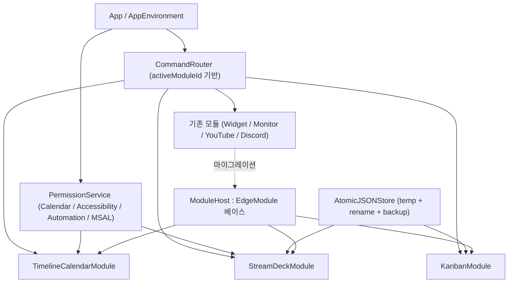
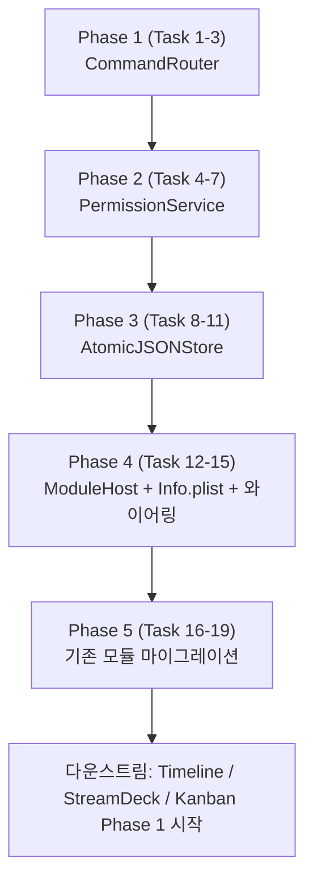

# Module Infrastructure Implementation Plan

> **For agentic workers:** Use superpowers:subagent-driven-development or superpowers:executing-plans to implement task-by-task. Steps use `- [ ]` checkboxes.

**Goal:** Timeline Calendar / Stream Deck / Kanban plan 의 codex 리뷰에서 드러난 공통 P1 결함을 해소할 수 있도록 모듈 공통 인프라 4종을 먼저 도입한다. `CommandRouter` (active-module 단축키 라우팅), `PermissionService` (권한 상태 통합), `AtomicJSONStore` (crash-safe 영속화), `ModuleHost` (module 이 store/vm 을 소유하는 ViewModel 주입 패턴). 추가로 Info.plist 가 build setting 으로 생성되는 현재 빌드 구조에 맞게 권한·URL scheme 추가 절차를 정리한다.

**Architecture:**



**Tech Stack:** Swift 5.9, SwiftUI 5+, AppKit, Foundation `FileManager`/`AtomicFile`, `Security` (Keychain), Combine 또는 Swift Concurrency `AsyncStream`, XCTest. macOS 14+ 유지. 외부 SPM 없음.

**Source:** 이 plan 은 별도 spec 파일 없이 codex review (2026-05-15) 의 공통 문제 섹션 + 각 모듈 plan 의 P1 항목을 근거로 작성됨.

**선행 의존성:** 없음 — 이 plan 의 Phase 1~4 가 끝난 후에 Timeline / Stream Deck / Kanban plan 의 Phase 1 을 시작한다.

---

## Codex Review Corrections (2026-05-15)

| 영역 | 원본 | 수정 |
|---|---|---|
| Downstream blocker | Phase 1~5 완료 후 시작 | **Phase 1~4 완료 시점부터 가능**. Phase 5 (기존 모듈 마이그레이션) 는 별도 cleanup track 으로 분리, downstream blocker 아님 |
| ModuleHost (Task 13) | 베이스 클래스 또는 protocol 도입 | **제거** — ADR (ViewModel 소유권) 으로 충분. 코드로 만들면 강제력 없는 abstraction 만 늘어남 |
| PermissionKind.automation | 단일 enum case | 현재 MVP 는 `targetBundleIdentifier` 를 probe init 에 받음. 다중 앱 TCC 표현 필요 시 추후 `PermissionKey enum` 으로 리팩토 (Timeline/Outlook + StreamDeck/AppleScript 가 다른 앱 대상이 되는 시점) |
| AsyncStream observability (Task 6) | OS notification 기반 | 과장됨. EKEventStoreChanged 는 데이터 변경이지 권한 변경 아님. **refresh() 정책으로 단순화** — app activation, NSWindowDidBecomeKey, 모듈 didBecomeActive 시점에 호출 |
| .commands UX (Task 2) | `handle` 만 | `canHandle` / disabled state 누락. 메뉴는 항상 enabled. P3 후속 task 로 `ModuleCommandHandler.canHandle(_:) -> Bool` 추가, SwiftUI `.disabled(!handler.canHandle(.delete))` 와이어링 |
| 파일 경로 | `App/EdgeLauncherApp.swift` | 실제 경로는 `EdgeLauncher/EdgeLauncherApp.swift`. 구현은 정확한 경로 사용 |
| Downstream plan body | Resources/Info.plist 잔존 | 본문 task body 들의 "Info.plist" 표현을 `INFOPLIST_KEY_*` build setting 으로 명시 갱신 (downstream P3 follow-up) |

---

## File Structure

```
EdgeLauncher/
├── Core/
│   ├── Command/
│   │   ├── ModuleCommand.swift                       # 신규: enum (.newItem, .delete, .refresh, .undo 등)
│   │   ├── CommandRouter.swift                       # 신규: @Observable, active module 라우팅
│   │   ├── CommandRouterEnvironment.swift            # 신규: EnvironmentKey + View+ext
│   │   └── ModuleCommandHandler.swift                # 신규: protocol
│   ├── Permission/
│   │   ├── PermissionService.swift                   # 신규: 통합 권한 상태
│   │   ├── PermissionKind.swift                      # 신규: enum (calendar/accessibility/automation/msal)
│   │   ├── PermissionState.swift                     # 신규: enum (unknown/authorized/denied/restricted/notDetermined)
│   │   ├── CalendarPermissionProbe.swift             # 신규: EventKit
│   │   ├── AccessibilityPermissionProbe.swift        # 신규: AXIsProcessTrusted
│   │   ├── AutomationPermissionProbe.swift           # 신규: OSAKit/AEDeterminePermissionToAutomateTarget
│   │   └── PermissionPromptView.swift                # 신규: 공통 onboarding UI
│   ├── Persistence/
│   │   ├── AtomicJSONStore.swift                     # 신규: 제네릭 store
│   │   ├── AtomicFileWriter.swift                    # 신규: temp + rename
│   │   ├── BackupRotator.swift                       # 신규: .bak 회전
│   │   ├── DebouncedSaver.swift                      # 신규: schedule + flush 분리
│   │   └── SchemaVersion.swift                       # 신규: migration 베이스
│   ├── Module/
│   │   ├── EdgeModule.swift                          # 수정: command/permission 훅 추가
│   │   ├── ModuleHost.swift                          # 신규: store/vm 소유 베이스 클래스
│   │   └── ModuleRegistry.swift                      # 수정: CommandRouter 와 연결
│   └── Build/
│       └── InfoPlistRecipes.md                       # 신규: build setting 으로 키 추가하는 방법 문서
├── App/
│   ├── EdgeLauncherApp.swift                         # 수정: .commands 를 CommandRouter 로 위임
│   └── AppEnvironment.swift                          # 수정: CommandRouter/PermissionService 인스턴스
└── EdgeLauncherTests/
    ├── CommandRouterTests.swift                      # 신규
    ├── PermissionServiceTests.swift                  # 신규 (probe mock)
    ├── AtomicJSONStoreTests.swift                    # 신규
    ├── DebouncedSaverTests.swift                     # 신규
    ├── BackupRotatorTests.swift                      # 신규
    └── ModuleHostTests.swift                         # 신규
```

---

## ADR — Observation Model 결정

**Decision:** 신규 코드는 모두 `@Observable` (Swift 5.9 매크로) 사용. `ObservableObject` + `@Published` 는 새로 작성하지 않는다.

**Rationale:**
- macOS 14+ 가 minimum 이므로 `@Observable` 가용
- `EdgeLauncher.docs.superpowers.specs/2026-05-15-edge-launcher-polish-design.md` 와 일관
- `@Published` 와 `@Observable` 혼용 시 fine-grained tracking 이 깨짐 (codex P1)

**Migration:** 기존 `@Published` 사용처 (`LauncherStore`, `WeatherService` 등) 는 이 plan 의 Phase 5 에서 마이그레이션. 신규 store/VM 은 처음부터 `@Observable`.

---

## ADR — ViewModel 소유권

**Decision:** Module 이 store/service/viewModel 을 owned property 로 가진다. View 는 init 시 주입받는다. View 안에서 `@StateObject` / `@State` 로 ViewModel 을 만들지 않는다.

```swift
// 예시 (StreamDeck)
final class StreamDeckModule: EdgeModule {
    let id = "streamdeck"
    let store: StreamDeckStore                        // module 이 소유
    let viewModel: StreamDeckViewModel                // module 이 소유
    let permissionService: PermissionService

    init(permissionService: PermissionService) {
        self.permissionService = permissionService
        self.store = StreamDeckStore()
        self.viewModel = StreamDeckViewModel(store: store, permission: permissionService)
    }

    var view: some View {
        StreamDeckView(viewModel: viewModel)          // 주입
    }

    func didBecomeActive() { viewModel.activate() }
    func didResignActive() { viewModel.deactivate() }
}
```

**Rationale:** View 가 ViewModel 을 만들면 module lifecycle 훅에서 그 ViewModel 을 제어할 수 없음 (codex P1). 또한 view 재생성 시 ViewModel 이 사라지는 문제 회피.

---

# Phase 1 — CommandRouter

## Task 1: ModuleCommand 정의 + CommandRouter

**Files:**
- Create: `Core/Command/ModuleCommand.swift`
- Create: `Core/Command/CommandRouter.swift`
- Create: `Core/Command/ModuleCommandHandler.swift`

- [ ] **Step 1: ModuleCommand enum**

```swift
enum ModuleCommand: String, CaseIterable {
    case newItem            // Cmd+N
    case editItem           // Cmd+E
    case delete             // Cmd+Delete
    case refresh            // Cmd+R
    case undo               // Cmd+Z
    case redo               // Shift+Cmd+Z
    case search             // Cmd+F
    case today              // Cmd+T (timeline)
    case nextDay            // Cmd+→
    case prevDay            // Cmd+←
    case slot1, slot2, slot3, slot4, slot5, slot6, slot7, slot8, slot9  // Cmd+1..9
}
```

- [ ] **Step 2: ModuleCommandHandler protocol**

```swift
@MainActor protocol ModuleCommandHandler: AnyObject {
    func handle(_ command: ModuleCommand) -> Bool   // 처리됐으면 true
}
```

- [ ] **Step 3: CommandRouter**

```swift
@Observable @MainActor
final class CommandRouter {
    var activeModuleId: String?
    private var handlers: [String: WeakHandler] = [:]
    private var globalDefaults: [ModuleCommand: () -> Void] = [:]  // 미처리 시 fallback

    func register(_ handler: ModuleCommandHandler, for moduleId: String)
    func unregister(moduleId: String)
    func setGlobalDefault(_ command: ModuleCommand, action: @escaping () -> Void)
    func dispatch(_ command: ModuleCommand)         // active 모듈 → handler.handle → 미처리면 global default
}
```

- [ ] **Step 4: 단위 테스트** — 등록·해제, active 변경, 미처리 fallback, 약한 참조로 메모리 누수 없음.
- [ ] **Step 5: Commit** — `feat(command): module command router`

---

## Task 2: SwiftUI .commands 통합

**Files:**
- Modify: `App/EdgeLauncherApp.swift`
- Modify: `App/AppEnvironment.swift`

- [ ] **Step 1: AppEnvironment 에 router 인스턴스.**
- [ ] **Step 2: ModuleRegistry 가 activeModuleId 변경 시 router 에 통보.**
- [ ] **Step 3: `.commands` 에서 단축키 → `router.dispatch(.newItem)` 호출.**

```swift
.commands {
    CommandGroup(after: .newItem) {
        Button("New Item") { router.dispatch(.newItem) }.keyboardShortcut("n", modifiers: .command)
        Button("Refresh") { router.dispatch(.refresh) }.keyboardShortcut("r", modifiers: .command)
        // ...
    }
}
```

- [ ] **Step 4: `Cmd+1..9` 의 기존 탭 전환은 global default 로 등록** — module 이 slot1..9 처리하지 않으면 탭 전환.
- [ ] **Step 5: 화면 확인** — 기존 탭 전환 회귀 없음.
- [ ] **Step 6: Commit** — `feat(command): wire SwiftUI commands to router`

---

## Task 3: Environment 주입

**Files:**
- Create: `Core/Command/CommandRouterEnvironment.swift`

- [ ] **Step 1: EnvironmentKey + `\.commandRouter`.**
- [ ] **Step 2: View extension** — `.commandHandler(_:for:)` 으로 module view 에서 등록·해제 자동.

```swift
extension View {
    func commandHandler(_ handler: ModuleCommandHandler, for moduleId: String) -> some View {
        environment(\.commandRouter, ...)
            .onAppear { router.register(handler, for: moduleId) }
            .onDisappear { router.unregister(moduleId: moduleId) }
    }
}
```

- [ ] **Step 3: Commit** — `feat(command): environment injection`

---

# Phase 2 — PermissionService

## Task 4: PermissionKind / PermissionState / Probe protocol

**Files:**
- Create: `Core/Permission/PermissionKind.swift`
- Create: `Core/Permission/PermissionState.swift`

- [ ] **Step 1: enum 정의**

```swift
enum PermissionKind: String { case calendar, accessibility, automation, msal }

enum PermissionState: Equatable {
    case unknown
    case notDetermined
    case denied
    case restricted
    case writeOnly                  // calendar 전용
    case authorized
}
```

- [ ] **Step 2: protocol PermissionProbe**

```swift
protocol PermissionProbe {
    var kind: PermissionKind { get }
    func currentState() async -> PermissionState
    func request() async throws -> PermissionState
    func openSystemSettings()
}
```

- [ ] **Step 3: Commit** — `feat(permission): types and probe protocol`

---

## Task 5: 3종 probe 구현

**Files:**
- Create: `Core/Permission/CalendarPermissionProbe.swift`
- Create: `Core/Permission/AccessibilityPermissionProbe.swift`
- Create: `Core/Permission/AutomationPermissionProbe.swift`

- [ ] **Step 1: CalendarPermissionProbe** — `EKEventStore.authorizationStatus(for: .event)` 의 모든 case 매핑 (`.fullAccess` → authorized, `.writeOnly` → writeOnly, `.denied` → denied, `.restricted` → restricted, `.notDetermined` → notDetermined).
- [ ] **Step 2: AccessibilityPermissionProbe** — `AXIsProcessTrustedWithOptions` (prompt false). request 는 prompt true 한 번.
- [ ] **Step 3: AutomationPermissionProbe** — `AEDeterminePermissionToAutomateTarget` 로 대상 앱별. 호출자가 bundle id 지정.
- [ ] **Step 4: openSystemSettings()** — 각각 적절한 URL (`x-apple.systempreferences:com.apple.preference.security?Privacy_Calendars` 등).
- [ ] **Step 5: 단위 테스트** — probe 로직 자체보다는 상태 매핑 정확성 (mock authorizationStatus 주입).
- [ ] **Step 6: Commit** — `feat(permission): calendar/accessibility/automation probes`

---

## Task 6: PermissionService + 변경 옵저버

**Files:**
- Create: `Core/Permission/PermissionService.swift`

- [ ] **Step 1: 구현**

```swift
@Observable @MainActor
final class PermissionService {
    private var probes: [PermissionKind: any PermissionProbe] = [:]
    private(set) var states: [PermissionKind: PermissionState] = [:]

    init(probes: [any PermissionProbe]) { ... }
    func refresh() async                              // 모든 probe currentState
    func refresh(_ kind: PermissionKind) async
    func request(_ kind: PermissionKind) async throws -> PermissionState
    func openSettings(for kind: PermissionKind)
    func observe(_ kind: PermissionKind) -> AsyncStream<PermissionState>  // EKEventStoreChanged 등
}
```

- [ ] **Step 2: AppEnvironment 에 single instance 등록.**
- [ ] **Step 3: 단위 테스트** — mock probe 주입, 상태 변경 stream.
- [ ] **Step 4: Commit** — `feat(permission): unified service`

---

## Task 7: PermissionPromptView 공통 UI

**Files:**
- Create: `Core/Permission/PermissionPromptView.swift`

- [ ] **Step 1: state 별 분기** — notDetermined 면 "허용" 버튼, denied/restricted 면 "시스템 설정 열기" 버튼, writeOnly 면 안내.
- [ ] **Step 2: 큰 아이콘 + 한국어 안내 + 부가 설명 슬롯.**
- [ ] **Step 3: 모듈 (Timeline, StreamDeck) 이 이 view 를 빈 상태로 사용.**
- [ ] **Step 4: Commit** — `feat(permission): shared prompt view`

---

# Phase 3 — AtomicJSONStore

## Task 8: AtomicFileWriter

**Files:**
- Create: `Core/Persistence/AtomicFileWriter.swift`
- Create: `EdgeLauncherTests/AtomicJSONStoreTests.swift`

- [ ] **Step 1: 구현**

```swift
struct AtomicFileWriter {
    static func write(_ data: Data, to url: URL) throws {
        let dir = url.deletingLastPathComponent()
        try FileManager.default.createDirectory(at: dir, withIntermediateDirectories: true)
        let temp = dir.appendingPathComponent(".\(url.lastPathComponent).tmp.\(UUID().uuidString)")
        try data.write(to: temp, options: .atomic)
        _ = try FileManager.default.replaceItemAt(url, withItemAt: temp)
    }
}
```

- [ ] **Step 2: 단위 테스트** — 정상 저장, 중간 실패 시 원본 보존, 동시 write race.
- [ ] **Step 3: Commit** — `feat(persistence): atomic file writer`

---

## Task 9: BackupRotator

**Files:**
- Create: `Core/Persistence/BackupRotator.swift`

- [ ] **Step 1: 저장 직전 현재 파일을 `<name>.bak.N` 으로 회전 (최대 3개 유지).**
- [ ] **Step 2: 손상된 메인 파일 감지 시 가장 최신 백업으로 복원.**
- [ ] **Step 3: 단위 테스트** — 회전, 복원, 회전 한계.
- [ ] **Step 4: Commit** — `feat(persistence): backup rotator`

---

## Task 10: DebouncedSaver

**Files:**
- Create: `Core/Persistence/DebouncedSaver.swift`
- Create: `EdgeLauncherTests/DebouncedSaverTests.swift`

- [ ] **Step 1: 구현 (schedule + flush 분리)**

```swift
actor DebouncedSaver {
    private var pendingTask: Task<Void, Never>?
    private var lastError: Error?
    let interval: Duration
    let action: @Sendable () async throws -> Void

    func schedule()                              // pendingTask 재설정
    func flush() async throws                    // 진행 중 작업 즉시 완료 + 에러 throw
    func cancel()
}
```

- [ ] **Step 2: 단위 테스트** — 빠른 연속 schedule 시 마지막 1회만 실행, flush 가 에러 전파.
- [ ] **Step 3: Commit** — `feat(persistence): debounced saver with explicit flush`

---

## Task 11: SchemaVersion + AtomicJSONStore

**Files:**
- Create: `Core/Persistence/SchemaVersion.swift`
- Create: `Core/Persistence/AtomicJSONStore.swift`

- [ ] **Step 1: SchemaVersion**

```swift
protocol Versioned {
    static var schemaVersion: Int { get }
}

struct Envelope<T: Codable & Versioned>: Codable {
    let schemaVersion: Int
    let payload: T
}
```

- [ ] **Step 2: AtomicJSONStore**

```swift
@Observable @MainActor
final class AtomicJSONStore<T: Codable & Versioned> {
    private let url: URL
    private let saver: DebouncedSaver
    private(set) var value: T

    init(url: URL, default: T, debounce: Duration = .milliseconds(800)) throws
    func update(_ block: (inout T) -> Void)       // value 변경 + saver.schedule()
    func flush() async throws                     // saver.flush()
    func reload() throws                          // 디스크 → value
    func migrate(from: Int, data: Data) throws -> T  // 서브클래스/콜백
}
```

- [ ] **Step 3: 손상 파일 처리** — JSONDecoder 실패 시 BackupRotator.restore 시도, 그래도 실패면 default + 사용자 alert.
- [ ] **Step 4: 단위 테스트** — 라운드트립, schema 버전 mismatch, 손상 복구, 동시 update + flush.
- [ ] **Step 5: Commit** — `feat(persistence): atomic JSON store with schema versioning`

---

# Phase 4 — ModuleHost + EdgeModule 확장 + Info.plist 가이드

## Task 12: EdgeModule 프로토콜 확장

**Files:**
- Modify: `Core/Module/EdgeModule.swift`

- [ ] **Step 1: 옵션 훅 추가**

```swift
protocol EdgeModule {
    associatedtype Body: View
    var id: String { get }
    var title: String { get }
    var iconName: String { get }
    var supportsFullscreen: Bool { get }
    @ViewBuilder var view: Body { get }

    var commandHandler: ModuleCommandHandler? { get }     // 신규 (옵션)
    var requiredPermissions: [PermissionKind] { get }     // 신규 (옵션)

    func didBecomeActive()
    func didResignActive()
    func willTerminate() async                            // 신규: flush 등
}

extension EdgeModule {
    var commandHandler: ModuleCommandHandler? { nil }
    var requiredPermissions: [PermissionKind] { [] }
    func didBecomeActive() {}
    func didResignActive() {}
    func willTerminate() async {}
}
```

- [ ] **Step 2: ModuleRegistry 가 active 변경 시 commandHandler 를 router 에 자동 등록·해제.**
- [ ] **Step 3: AppEnvironment 가 종료 직전 모든 모듈 willTerminate 병렬 호출 (NSApplicationWillTerminate).**
- [ ] **Step 4: 단위 테스트** — 등록 자동화.
- [ ] **Step 5: Commit** — `feat(module): extend EdgeModule with command and permission hooks`

---

## Task 13: ModuleHost 베이스

**Files:**
- Create: `Core/Module/ModuleHost.swift`

- [ ] **Step 1: 베이스 클래스 또는 헬퍼 protocol** — module 이 store/service/vm 을 가지고 view 에 주입하는 패턴을 명시적으로.

```swift
@MainActor
protocol HostedModule: EdgeModule {
    associatedtype State: AnyObject
    var state: State { get }
}
```

또는 베이스 클래스:

```swift
@MainActor
class ModuleHost<V: View> {
    let router: CommandRouter
    let permission: PermissionService
    init(router: CommandRouter, permission: PermissionService) { ... }
}
```

선택은 구현 시점에 단순한 쪽으로. 단위 테스트로 동작 검증.

- [ ] **Step 2: 단위 테스트** — module init → store/vm 인스턴스 생성, view init 시 동일 인스턴스 주입.
- [ ] **Step 3: Commit** — `feat(module): module host base`

---

## Task 14: Info.plist 가이드 문서

**Files:**
- Create: `Core/Build/InfoPlistRecipes.md`

- [ ] **Step 1: 현재 빌드 설정 확인** — `xcodebuild -showBuildSettings | grep GENERATE_INFOPLIST_FILE` 가 YES 이므로 Info.plist 파일을 직접 만들면 무시되거나 충돌.
- [ ] **Step 2: 키 추가 방법 문서화**

| 키 | 빌드 설정 | 예시 |
|---|---|---|
| `NSCalendarsFullAccessUsageDescription` | `INFOPLIST_KEY_NSCalendarsFullAccessUsageDescription` | "오늘 일정을 타임라인에 표시합니다" |
| `NSAppleEventsUsageDescription` | `INFOPLIST_KEY_NSAppleEventsUsageDescription` | "AppleScript 액션 실행에 필요합니다" |
| `CFBundleURLTypes` | Other Info.plist Entries 직접 추가 또는 `INFOPLIST_FILE` 부분 합병 | MSAL redirect scheme |

- [ ] **Step 3: pbxproj 수정 절차 (xcconfig 또는 build settings UI).**
- [ ] **Step 4: Timeline/StreamDeck plan 에 해당 task 의 "Info.plist 수정" 표현을 "build setting INFOPLIST_KEY_* 추가" 로 정정하는 별도 PR 메모.**
- [ ] **Step 5: Commit** — `docs(build): info.plist via build settings`

---

## Task 15: AppEnvironment 와이어링

**Files:**
- Modify: `App/AppEnvironment.swift`

- [ ] **Step 1: 단일 인스턴스** — `let commandRouter: CommandRouter`, `let permissionService: PermissionService`.
- [ ] **Step 2: 모듈 생성자에 주입** — 기존 등록 코드 수정.
- [ ] **Step 3: SwiftUI environment 에 노출.**
- [ ] **Step 4: Commit** — `feat(app): wire infrastructure into AppEnvironment`

---

# Phase 5 — 기존 모듈 마이그레이션 + 회귀 검증

## Task 16: 기존 모듈 ViewModel 소유권 정리

**Files:**
- Modify: `Modules/WidgetDashboard/*`, `Modules/SystemMonitor/*`, `Modules/Launcher/*`, `Modules/Messenger/*`, `Modules/YouTube/*`, `Modules/YouTubeMusic/*`

- [ ] **Step 1: 각 module 이 자신의 store/service 를 owned property 로** — View 안에서 `@StateObject` 생성을 모두 제거.
- [ ] **Step 2: View init 에서 ViewModel 주입.**
- [ ] **Step 3: lifecycle 훅에서 ViewModel 메서드 호출이 가능한지 확인.**
- [ ] **Step 4: 화면 확인 (각 모듈).**
- [ ] **Step 5: Commit** — `refactor(modules): module-owned view models`

---

## Task 17: @Published → @Observable 마이그레이션

**Files:**
- Modify: `Modules/Launcher/LauncherStore.swift`, `Modules/WidgetDashboard/WeatherService.swift`, `Modules/WidgetDashboard/EventStoreVM.swift`, 기타 ObservableObject

- [ ] **Step 1: 클래스 선언에 `@Observable` 추가, `ObservableObject` 제거.**
- [ ] **Step 2: 모든 `@Published` 제거 (그냥 var).**
- [ ] **Step 3: View 의 `@StateObject` / `@ObservedObject` → 일반 let.**
- [ ] **Step 4: 회귀 — 각 위젯·런처 동작.**
- [ ] **Step 5: Commit** — `refactor(modules): migrate to @Observable`

---

## Task 18: Tab 전환 단축키를 CommandRouter global default 로

**Files:**
- Modify: `App/EdgeLauncherApp.swift`, `Core/Module/ModuleRegistry.swift`

- [ ] **Step 1: 기존 Cmd+1..9 (탭 전환) 을 `router.setGlobalDefault(.slot1) { registry.activate(index: 0) }` 형태로 등록.**
- [ ] **Step 2: 모듈이 slot1..9 를 직접 처리하면 (예: StreamDeck 페이지 전환) global default 가 호출되지 않음.**
- [ ] **Step 3: 회귀 — 기존 탭 전환 동작.**
- [ ] **Step 4: Commit** — `refactor(command): global defaults for tab switching`

---

## Task 19: 인프라 릴리즈 + 문서

- [ ] **Step 1: 전체 회귀 — 모든 기존 모듈, 단축키, 풀스크린, Edge 디스플레이 자동 이동.**
- [ ] **Step 2: GUIDE.md 에 "모듈 인프라" 섹션** — 새 모듈 작성 시 CommandRouter/PermissionService/AtomicJSONStore 사용 가이드.
- [ ] **Step 3: README 의 아키텍처 부분 갱신.**
- [ ] **Step 4: 버전 0.3.0 bump, CHANGELOG (`### Infrastructure` 섹션).**
- [ ] **Step 5: Commit** — `docs: module infrastructure release notes`

---

## 검증 체크리스트 (Phase 4 종료 시점)

- [ ] `bash scripts/test.sh` 그린 (신규 + 기존 테스트)
- [ ] `make build` warning 0
- [ ] 기존 모듈 6개 (Widget / Monitor / Launcher / Messenger / YouTube / YouTubeMusic) 회귀 없음
- [ ] Cmd+1..9 탭 전환 정상
- [ ] 메모리: CommandRouter 약한 참조로 모듈 deinit 시 누수 없음
- [ ] AtomicJSONStore 손상 파일 → 백업 복구 동작
- [ ] DebouncedSaver flush 에서 에러 전파 확인

---

## 다운스트림 plan 에 미치는 영향

각 모듈 plan 은 이 인프라 plan 완료 후 아래 항목들이 자동 해소된다.

| 모듈 plan task | 해소 방법 |
|---|---|
| Timeline Task 5 의 `EventKitProvider` mock 주입 | `CalendarProvider` protocol (이 plan Task 5) + mock |
| Timeline Task 10 의 권한 거부 처리 | `PermissionPromptView` 재사용 |
| Timeline Task 11 의 EKEventStoreChanged 옵저버 | `PermissionService.observe(.calendar)` |
| StreamDeck Task 2 의 store 저장/로드 + 백업 | `AtomicJSONStore<StreamDeckPages>` 로 대체 |
| StreamDeck Task 3 의 KeystrokeSender 권한 | `PermissionService.request(.accessibility)` |
| StreamDeck Task 9 의 Cmd+E 단축키 | `commandHandler.handle(.editItem)` |
| Kanban Task 2 의 저장 atomicity | `AtomicJSONStore<KanbanBoard>` 보드 단위 |
| Kanban Task 9 의 단축키 | `commandHandler` |
| 세 모듈 모두의 ViewModel 소유 | `HostedModule` 패턴 |
| 세 모듈 모두의 Info.plist 수정 | `InfoPlistRecipes.md` 의 build setting 절차 |

---

## 비목표

- 모듈 간 직접 통신 (예: Kanban 카드 → Timeline 일정 즉시 동기화) — 별도 EventBus 가 필요해지면 그 시점에 추가
- macOS 키체인 헬퍼 일반화 — MSAL 통합 시점 (Timeline Phase 3) 에 별도 task 로 분리
- 외부 SPM 도입 (GRDB 등) — 의사결정 보류

---

## 작업 순서



Phase 1~4 가 인프라 도입. Phase 5 는 기존 모듈 회귀 검증 겸 마이그레이션. 끝나면 v0.3.0 릴리즈 후 세 모듈 plan 의 Phase 1 을 병렬로 시작 가능.

**예상 작업량**: Phase 1~4 합산 약 2~3일, Phase 5 마이그레이션 1일.

---

## 다운스트림 plan 정정 메모 (이 plan 완료 후 처리)

- `2026-05-15-timeline-calendar.md` Task 1 의 `Info.plist` 수정 → build setting `INFOPLIST_KEY_NSCalendarsFullAccessUsageDescription`
- `2026-05-15-timeline-calendar.md` Task 18 의 `CFBundleURLTypes` → `INFOPLIST_KEY_*` 또는 Other Info.plist Entries
- `2026-05-15-streamdeck.md` Task 14 의 `NSAppleEventsUsageDescription` → build setting
- 세 plan 모두 version bump 를 release train 으로 재절단 (이 plan v0.3.0 → Timeline v0.4.0 → Kanban v0.5.0 → StreamDeck v0.6.0)
