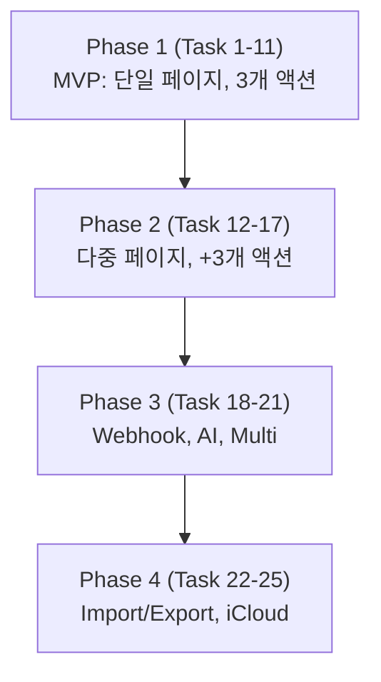

# Stream Deck Pad Implementation Plan

> **For agentic workers:** REQUIRED SUB-SKILL: Use superpowers:subagent-driven-development (recommended) or superpowers:executing-plans to implement this plan task-by-task. Steps use checkbox (`- [ ]`) syntax for tracking.

**Goal:** EdgeLauncher 의 32:9 멀티터치 디스플레이를 거대한 매크로 패드로 활용한다. 8×3 그리드의 큰 터치 버튼으로 앱 실행·단축키·셸·AppleScript·웹훅·AI 프롬프트를 한 손가락 탭으로 발사. 다중 페이지, 편집 모드, JSON 영속화.

**Architecture:** `StreamDeckModule (EdgeModule)` → `StreamDeckView` → `StreamDeckViewModel (@Observable)` → `StreamDeckStore` (JSON 영속) + `ActionExecutor` (액션 dispatch). 액션 타입은 `enum StreamDeckAction` sealed sum type 으로 9가지. 권한 필요 액션(Accessibility, Automation) 은 첫 사용 시 onboarding.

**Tech Stack:** Swift 5.9, SwiftUI, AppKit, CoreHaptics(없음 — macOS 는 NSHapticFeedbackPerformer), Carbon (keystroke 시뮬레이션), OSAKit (AppleScript), URLSession (webhook), Process (셸), XCTest. macOS 14+ 유지. 외부 SPM 없음.

**Spec:** `docs/superpowers/specs/2026-05-15-streamdeck-spec.md`
**선행 의존성:** `docs/superpowers/plans/2026-05-15-module-infrastructure.md` Phase 1~4 완료 후 시작.

---

## Codex Review Corrections (2026-05-15)

| 영역 | 원본 | 수정 |
|---|---|---|
| Info.plist 수정 (Task 14) | `EdgeLauncher/Resources/Info.plist` 직접 수정 | `INFOPLIST_KEY_NSAppleEventsUsageDescription` build setting 추가 |
| Observation 모델 | `@Published` (Store) + `@Observable` (VM) 혼용 | 인프라 plan ADR 에 따라 **모두 `@Observable`** 통일. `@Published` 사용 금지 |
| 저장 API (Task 2) | `save() throws` + debounce | `scheduleSave()` (즉시 반환) + `flush() async throws` (didResignActive 에서) 분리. 인프라 plan 의 `DebouncedSaver` 사용 |
| Store 영속화 (Task 2) | 자체 JSON 처리 | 인프라 plan 의 `AtomicJSONStore<StreamDeckPages>` 사용 — temp+rename, BackupRotator, SchemaVersion 자동 |
| 보안 모델 (Task 13, 14, 15, 18, 19) | 액션별 산발 | **Task 12 이전에 P1 Security Gate task 추가** — confirm UI / allowlist / Keychain secret / audit log / timeout / output panel 공통 인프라 먼저 |
| Codable 영속화 | enum associated value 자동 합성 | explicit tagged schema + `schemaVersion: Int`. 인프라 plan 의 `Versioned` 프로토콜 채택 |
| KeystrokeSender (Task 3) | Accessibility 권한만 | Secure Input 검사, keyboard layout 분기, target app focus 확인, system shortcut 차단 대응, keycode mapping 폴백 |
| TextPaster (Task 15) | clipboard set + Cmd+V | 기존 pasteboard snapshot → set → paste → 복원. 타입 보존 (`NSPasteboard.PasteboardType` 다중) |
| AppleScriptRunner (Task 14) | "시스템이 자동 prompt" | TCC error code 분류, 대상 앱별 실패 안내. `PermissionService.request(.automation)` 위임 |
| AIPromptRunner (Task 19) | "외부 의존성 없음" | CLI 존재 확인, PATH 추적, API key Keychain 저장, long-running cancellation, output panel UI 명시 |
| 단축키 (Task 9) | `EdgeLauncherApp.swift` 직접 | 인프라 plan 의 `CommandRouter` 로 위임. module 의 `commandHandler` 가 `.editItem / .slot1..9 / .newItem` 처리 |
| 버전 bump | P1=0.5.0, P2=0.6.0, P3=0.7.0 | **P1=0.6.0, P2=0.7.0, P3=0.8.0** |

---

## File Structure

```
EdgeLauncher/
├── Modules/
│   └── StreamDeck/
│       ├── StreamDeckModule.swift                      # 신규: EdgeModule
│       ├── StreamDeckView.swift                        # 신규: 루트 뷰
│       ├── StreamDeckViewModel.swift                   # 신규: @Observable
│       ├── Views/
│       │   ├── PageBarView.swift                       # 신규: 상단 페이지 탭
│       │   ├── ButtonGridView.swift                    # 신규: 그리드 컨테이너
│       │   ├── StreamDeckButtonView.swift              # 신규: 단일 버튼 셀
│       │   ├── ActionPickerSheet.swift                 # 신규: 액션 타입 선택
│       │   ├── ActionEditorView.swift                  # 신규: 액션별 편집 UI
│       │   ├── IconPickerView.swift                    # 신규: SFSymbol/이모지/이미지
│       │   └── EditModeOverlay.swift                   # 신규: 편집 모드 wiggle + X
│       ├── Model/
│       │   ├── StreamDeckPage.swift                    # 신규
│       │   ├── StreamDeckButton.swift                  # 신규
│       │   ├── GridPosition.swift                      # 신규
│       │   ├── IconType.swift                          # 신규
│       │   └── StreamDeckAction.swift                  # 신규: 9개 case enum
│       ├── Store/
│       │   ├── StreamDeckStore.swift                   # 신규: JSON CRUD + 저장
│       │   └── StreamDeckMigrator.swift                # 신규: schema v1/v2
│       ├── Executor/
│       │   ├── ActionExecutor.swift                    # 신규: dispatch
│       │   ├── AppLauncher.swift                       # 신규: launchApp
│       │   ├── URLOpener.swift                         # 신규: openURL
│       │   ├── ShellRunner.swift                       # 신규: runShell
│       │   ├── KeystrokeSender.swift                   # 신규: CGEvent
│       │   ├── AppleScriptRunner.swift                 # 신규: OSAKit
│       │   ├── TextPaster.swift                        # 신규: NSPasteboard + Cmd+V
│       │   ├── WebhookCaller.swift                     # 신규: URLSession
│       │   ├── AIPromptRunner.swift                    # 신규: claude/codex/gemini CLI
│       │   └── MultiActionRunner.swift                 # 신규
│       └── Util/
│           ├── HapticPlayer.swift                      # 신규: NSHapticFeedbackPerformer
│           └── PermissionChecker.swift                 # 신규: Accessibility/Automation 상태
├── App/
│   └── AppEnvironment.swift                            # 수정: StreamDeckModule 등록
├── Resources/
│   └── Info.plist                                      # 수정: NSAppleEventsUsageDescription
└── EdgeLauncherTests/
    ├── StreamDeckStoreTests.swift                      # 신규
    ├── StreamDeckMigratorTests.swift                   # 신규
    ├── ActionExecutorTests.swift                       # 신규 (mock)
    ├── GridPositionTests.swift                         # 신규
    └── PermissionCheckerTests.swift                    # 신규
```

---

# Phase 1 — MVP (단일 페이지, 3개 액션 타입)

## Task 1: 도메인 모델

**Files:**
- Create: `Modules/StreamDeck/Model/*` (5 파일)

- [ ] **Step 1: enum / struct 정의** — Spec 의 4절 모델 그대로. `Codable`, `Identifiable`, `Hashable`. `StreamDeckAction` 은 `associated value` 가지는 enum, `Codable` 자동 합성 적용.
- [ ] **Step 2: GridPosition** — `row: Int`, `col: Int`, validate 헬퍼.
- [ ] **Step 3: 빌드 검증.**
- [ ] **Step 4: Commit** — `feat(streamdeck): add domain models`

---

## Task 2: StreamDeckStore JSON 영속

**Files:**
- Create: `Modules/StreamDeck/Store/StreamDeckStore.swift`
- Create: `EdgeLauncherTests/StreamDeckStoreTests.swift`

- [ ] **Step 1: 구현**

```swift
final class StreamDeckStore {
    private let url: URL
    @Published var pages: [StreamDeckPage] = []

    init(url: URL = StreamDeckStore.defaultURL) { ... }

    func load() throws
    func save() throws                  // debounce 500ms
    func addPage(_ page: StreamDeckPage)
    func removePage(id: UUID)
    func updateButton(pageId: UUID, _ button: StreamDeckButton)
    func moveButton(from: GridPosition, to: GridPosition, pageId: UUID)
}
```

- [ ] **Step 2: 기본 페이지 시드** — 최초 로드 시 빈 페이지 1개 자동 생성.
- [ ] **Step 3: 저장 백업** — `streamdeck.json.bak` 회전.
- [ ] **Step 4: 단위 테스트** — CRUD, 저장/로드 라운드트립, 손상 파일 복구.
- [ ] **Step 5: Commit** — `feat(streamdeck): add JSON store with backup`

---

## Task 3: ActionExecutor 스켈레톤 + 3개 액션

**Files:**
- Create: `Modules/StreamDeck/Executor/ActionExecutor.swift`
- Create: `Modules/StreamDeck/Executor/AppLauncher.swift`
- Create: `Modules/StreamDeck/Executor/URLOpener.swift`
- Create: `Modules/StreamDeck/Executor/KeystrokeSender.swift`
- Create: `EdgeLauncherTests/ActionExecutorTests.swift`

- [ ] **Step 1: ActionExecutor.run(_:)** — switch 로 dispatch.
- [ ] **Step 2: AppLauncher** — `NSWorkspace.shared.openApplication(at:configuration:completion:)`.
- [ ] **Step 3: URLOpener** — `NSWorkspace.shared.open(URL)`.
- [ ] **Step 4: KeystrokeSender** — CGEvent 로 modifier + key 시뮬레이션. Accessibility 권한 체크, 미허용 시 throw.
- [ ] **Step 5: 단위 테스트** — mock 프로토콜로 검증.
- [ ] **Step 6: Commit** — `feat(streamdeck): action executor with 3 basic actions`

---

## Task 4: StreamDeckModule + StreamDeckView 스켈레톤

**Files:**
- Create: `Modules/StreamDeck/StreamDeckModule.swift`
- Create: `Modules/StreamDeck/StreamDeckView.swift`
- Create: `Modules/StreamDeck/StreamDeckViewModel.swift`
- Modify: `App/AppEnvironment.swift`

- [ ] **Step 1: 모듈 등록** — `id="streamdeck"`, `title="Pad"`, `iconName="square.grid.3x3.fill"`.
- [ ] **Step 2: ViewModel** — `@Observable`, store 주입, 현재 페이지 인덱스, 편집 모드 플래그.
- [ ] **Step 3: View placeholder** — "Pad" 텍스트만.
- [ ] **Step 4: `make run` 화면 확인.**
- [ ] **Step 5: Commit** — `feat(streamdeck): register module skeleton`

---

## Task 5: ButtonGridView 그리드 레이아웃

**Files:**
- Create: `Modules/StreamDeck/Views/ButtonGridView.swift`
- Create: `Modules/StreamDeck/Views/StreamDeckButtonView.swift`

- [ ] **Step 1: 그리드 폭/높이 계산** — 컨텐츠 영역 기준 8 cols × 3 rows, 셀 spacing 12pt, 셀 cornerRadius 16pt, 셀 최소 88pt × 88pt.
- [ ] **Step 2: StreamDeckButtonView** — 아이콘 (SFSymbol 60pt) + 라벨 11pt + 배경색.
- [ ] **Step 3: 빈 슬롯** — 점선 보더 + + 아이콘.
- [ ] **Step 4: 화면 확인** — 빈 그리드 표시 정상.
- [ ] **Step 5: Commit** — `feat(streamdeck): render empty button grid`

---

## Task 6: 버튼 탭 → 액션 실행

**Files:**
- Modify: `StreamDeckViewModel.swift`, `StreamDeckButtonView.swift`

- [ ] **Step 1: ViewModel.execute(button:)** — `ActionExecutor.run(button.action)`. 실행 중 `executingButtonId` 표시.
- [ ] **Step 2: 0.3s 글로우 애니메이션** — 탭 직후 cyan glow.
- [ ] **Step 3: 에러 시 빨간 X 토스트.**
- [ ] **Step 4: 화면 확인** — 더미 버튼 추가 후 탭 → 메모장 앱 실행.
- [ ] **Step 5: Commit** — `feat(streamdeck): tap to execute action`

---

## Task 7: 편집 모드 + ActionEditor (3개 액션)

**Files:**
- Create: `Modules/StreamDeck/Views/EditModeOverlay.swift`
- Create: `Modules/StreamDeck/Views/ActionPickerSheet.swift`
- Create: `Modules/StreamDeck/Views/ActionEditorView.swift`

- [ ] **Step 1: 편집 모드 토글** — 헤더 우상단 펜 아이콘 또는 빈 영역 길게 누름 (1초).
- [ ] **Step 2: EditModeOverlay** — wiggle 애니메이션, X 삭제 표시.
- [ ] **Step 3: ActionPickerSheet** — 액션 타입 9개 grid (P1 에선 3개만 활성, 나머지 disabled + "coming").
- [ ] **Step 4: ActionEditorView** — 각 타입별 폼 (앱 선택 / URL / 키 조합).
- [ ] **Step 5: 빈 슬롯 탭 → ActionPicker → ActionEditor → 저장.**
- [ ] **Step 6: 채워진 버튼 길게 누름 → 편집 또는 삭제 메뉴.**
- [ ] **Step 7: Commit** — `feat(streamdeck): edit mode with action picker`

---

## Task 8: IconPicker (SFSymbol + 이모지)

**Files:**
- Create: `Modules/StreamDeck/Views/IconPickerView.swift`

- [ ] **Step 1: SFSymbol 검색** — 카테고리 + 텍스트 검색.
- [ ] **Step 2: 이모지 그리드** — 기본 800개.
- [ ] **Step 3: 색상 picker** — 배경/전경 hex.
- [ ] **Step 4: ActionEditor 에 통합.**
- [ ] **Step 5: Commit** — `feat(streamdeck): icon picker`

---

## Task 9: 단축키 + 햅틱

**Files:**
- Create: `Modules/StreamDeck/Util/HapticPlayer.swift`
- Modify: `App/EdgeLauncherApp.swift`

- [ ] **Step 1: HapticPlayer** — `NSHapticFeedbackManager.defaultPerformer.perform(.generic, performanceTime: .now)`.
- [ ] **Step 2: 버튼 탭 시 햅틱 발사.**
- [ ] **Step 3: 단축키** — Cmd+E (편집 모드 토글).
- [ ] **Step 4: Commit** — `feat(streamdeck): haptic feedback and Cmd+E`

---

## Task 10: PermissionChecker + Onboarding

**Files:**
- Create: `Modules/StreamDeck/Util/PermissionChecker.swift`

- [ ] **Step 1: Accessibility 권한 체크** — `AXIsProcessTrustedWithOptions`.
- [ ] **Step 2: keystroke 액션 첫 실행 시 미허용이면 안내 모달** — "시스템 설정 > 개인정보 보호 > 손쉬운 사용" 안내 + URL 열기.
- [ ] **Step 3: Commit** — `feat(streamdeck): accessibility permission onboarding`

---

## Task 11: P1 통합 + 문서

- [ ] **Step 1: 회귀 점검** — 다른 모듈, 단축키.
- [ ] **Step 2: README/GUIDE 에 Pad 탭 섹션 추가.**
- [ ] **Step 3: 버전 0.5.0 bump, CHANGELOG.**
- [ ] **Step 4: Commit** — `docs(streamdeck): phase 1 release notes`

---

# Phase 2 — 다중 페이지 + 추가 액션 (5개)

## Task 12: PageBarView 다중 페이지

**Files:**
- Create: `Modules/StreamDeck/Views/PageBarView.swift`

- [ ] **Step 1: 상단 페이지 탭** — `◀ [Work] [Dev] [Media] ▶ + 새 페이지`.
- [ ] **Step 2: 페이지 좌/우 스와이프** — `NSPanGestureRecognizer` 가로 ±60pt.
- [ ] **Step 3: Cmd+1..9 페이지 직행.**
- [ ] **Step 4: 페이지 길게 누름 → 이름·색상 편집·삭제.**
- [ ] **Step 5: Commit** — `feat(streamdeck): multi-page support`

---

## Task 13: ShellRunner 액션

**Files:**
- Create: `Modules/StreamDeck/Executor/ShellRunner.swift`

- [ ] **Step 1: `Process` 백그라운드 실행, stdout/stderr 캡처.**
- [ ] **Step 2: timeout 30s, 무한 실행 방지.**
- [ ] **Step 3: confirm 플래그** — 액션 정의에 `requiresConfirm: Bool`. true 면 실행 전 alert.
- [ ] **Step 4: 단위 테스트** — `echo hello` 출력 검증.
- [ ] **Step 5: Commit** — `feat(streamdeck): shell action with timeout and confirm`

---

## Task 14: AppleScriptRunner 액션

**Files:**
- Create: `Modules/StreamDeck/Executor/AppleScriptRunner.swift`

- [ ] **Step 1: OSAKit** — `OSAScript(source:)`.executeAndReturnError.
- [ ] **Step 2: Automation 권한 안내** — 첫 실행 시 시스템이 자동 prompt.
- [ ] **Step 3: Info.plist** — `NSAppleEventsUsageDescription` 추가.
- [ ] **Step 4: Commit** — `feat(streamdeck): applescript action`

---

## Task 15: TextPaster 액션

**Files:**
- Create: `Modules/StreamDeck/Executor/TextPaster.swift`

- [ ] **Step 1: NSPasteboard 에 텍스트 set.**
- [ ] **Step 2: 0.05s 후 Cmd+V 키스트로크 발사** — 활성 앱에 paste.
- [ ] **Step 3: 옵션: paste 안 하고 클립보드만.**
- [ ] **Step 4: Commit** — `feat(streamdeck): paste text action`

---

## Task 16: ActionPicker 5개 액션 활성화

- [ ] **Step 1: shell, appleScript, pasteText 활성화.**
- [ ] **Step 2: 각 액션의 ActionEditorView 작성.**
- [ ] **Step 3: 회귀 테스트.**
- [ ] **Step 4: Commit** — `feat(streamdeck): enable 3 advanced actions`

---

## Task 17: P2 릴리즈

- [ ] **Step 1: 0.6.0 bump.**
- [ ] **Step 2: Commit** — `docs(streamdeck): phase 2 release notes`

---

# Phase 3 — Webhook + AI 프롬프트 + 다중 액션

## Task 18: WebhookCaller

**Files:**
- Create: `Modules/StreamDeck/Executor/WebhookCaller.swift`

- [ ] **Step 1: URLSession POST/GET/PUT, headers, body.**
- [ ] **Step 2: URL 화이트리스트 옵션** — 설정에 허용 도메인 목록.
- [ ] **Step 3: 응답 status code 토스트.**
- [ ] **Step 4: Commit** — `feat(streamdeck): webhook action`

---

## Task 19: AIPromptRunner

**Files:**
- Create: `Modules/StreamDeck/Executor/AIPromptRunner.swift`

- [ ] **Step 1: provider enum** — claude / codex / gemini.
- [ ] **Step 2: 각 CLI 호출** — `claude -p "..."`, `codex ask "..."`, `gemini -p "..."`.
- [ ] **Step 3: 출력은 별도 시트로 표시 (markdown 렌더).**
- [ ] **Step 4: API 키 필요 시 Keychain 안내.**
- [ ] **Step 5: Commit** — `feat(streamdeck): AI prompt action`

---

## Task 20: MultiActionRunner

**Files:**
- Create: `Modules/StreamDeck/Executor/MultiActionRunner.swift`

- [ ] **Step 1: 액션 시퀀스 정의 (배열).**
- [ ] **Step 2: 순차 실행, 중간 실패 시 중단 옵션.**
- [ ] **Step 3: 각 단계 진행 표시.**
- [ ] **Step 4: Commit** — `feat(streamdeck): multi-action sequence`

---

## Task 21: P3 릴리즈

- [ ] **Step 1: 모든 9개 액션 활성화.**
- [ ] **Step 2: 0.7.0 bump.**
- [ ] **Step 3: Commit** — `docs(streamdeck): phase 3 release notes`

---

# Phase 4 — Import/Export + iCloud (outline)

| Task | 범위 |
|---|---|
| **Task 22** | JSON export — 단일 페이지 또는 전체 |
| **Task 23** | JSON import — 충돌 시 머지·덮어쓰기 선택 |
| **Task 24** | iCloud Drive 옵션 — Documents 위치로 store 경로 변경 |
| **Task 25** | 공유 URL — `edgelauncher://streamdeck/import?data=...` (base64) |

---

## 검증 체크리스트 (각 Phase 종료)

- [ ] `bash scripts/test.sh` 그린
- [ ] `make build` warning 0
- [ ] 다른 모듈 회귀 없음
- [ ] Accessibility / Automation 권한 거부 시 안내 동작
- [ ] 잘못된 JSON 파일 로드 시 백업으로 복구
- [ ] 1초에 10번 탭해도 액션 dispatch 안전

---

## 비목표

- 물리 Stream Deck 하드웨어 디바이스 연동 (별도 모듈)
- 매크로 녹화/재생
- 클라우드 마켓플레이스
- 동적 페이지 (스크립트로 버튼 생성)

---

## 작업 순서



Phase 1 ~ 4 모두 외부 의존성 없음 — 즉시 착수 가능.
