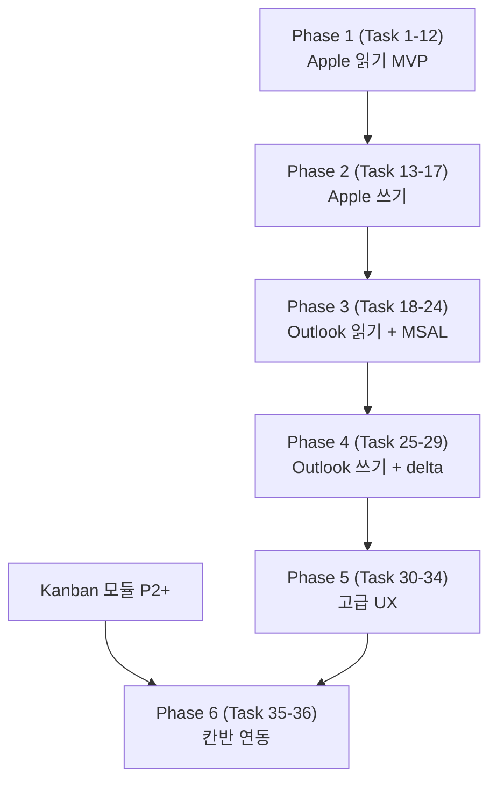

# Timeline Calendar Implementation Plan

> **For agentic workers:** REQUIRED SUB-SKILL: Use superpowers:subagent-driven-development (recommended) or superpowers:executing-plans to implement this plan task-by-task. Steps use checkbox (`- [ ]`) syntax for tracking.

**Goal:** 32:9 와이드 디스플레이의 가로축을 시간축으로 활용하는 풀스크린 타임라인 캘린더 모듈을 만든다. Apple Calendar(EventKit) 와 Microsoft 365 Outlook(Graph API + MSAL) 일정을 동시에 가로 timeline 에 펼치고, 추가·수정·삭제를 모듈 안에서 처리한다.

**Architecture:** `TimelineCalendarModule` 이 `EdgeModule` 프로토콜을 구현하며, 내부는 `TimelineCalendarView (SwiftUI)` → `TimelineViewModel (@Observable)` → `CalendarSyncService` → `[EventKitProvider, GraphProvider, LocalProvider]` 계층. `EventCache` 가 모든 소스를 통합 저장. MSAL 토큰은 Keychain. 인증·동기화·렌더는 분리해서 mock 가능한 단위로 유지.

**Tech Stack:** Swift 5.9, SwiftUI, AppKit, EventKit, MSAL (Microsoft Authentication Library for ObjC/Swift), URLSession, GRDB 또는 Apple `SQLite` C API, os.Logger, XCTest. macOS 14+ 타깃 유지. 외부 라이브러리는 SPM 으로 MSAL 만 추가.

**Spec:** `docs/superpowers/specs/2026-05-15-timeline-calendar-spec.md`
**Azure AD 요청서:** `docs/azure-ad-request.md`
**선행 의존성:** `docs/superpowers/plans/2026-05-15-module-infrastructure.md` Phase 1~4 완료 후 시작 — `CommandRouter`, `PermissionService`, `AtomicJSONStore`, `HostedModule` 패턴 사용.

---

## Codex Review Corrections (2026-05-15)

이 plan 은 codex 리뷰 결과 다음 항목이 보정되어 있다 (실행 시 적용):

| 영역 | 원본 | 수정 |
|---|---|---|
| Info.plist 수정 (Task 5, 18) | `EdgeLauncher/Resources/Info.plist` 직접 수정 | repo 에는 그 파일 없음. `GENERATE_INFOPLIST_FILE=YES` 빌드 설정 사용 중. `INFOPLIST_KEY_NSCalendarsFullAccessUsageDescription` build setting 추가. `CFBundleURLTypes` 는 `Other Info.plist Entries` 또는 별도 plist partial 합병 |
| TimelineEvent.id (Task 1) | `EventKit eventIdentifier` 단일 키 | `calendarItemIdentifier + source id + occurrence start` 조합 — sync/save 후 id 변경 대응 |
| EventKitProvider (Task 5) | concrete class | `CalendarProvider` protocol + concrete 구현. ViewModel 은 protocol 주입받아 mock 가능 |
| 권한 처리 (Task 10) | `.fullAccess` 만 체크 | `PermissionService` 위임. `.notDetermined / .denied / .restricted / .writeOnly / .authorized` 모두 분기 (인프라 plan Phase 2 산물) |
| Overlap layout | Phase 5 의 고급 기능 | 기본 collision layout 은 P1 MVP 에 포함 (lane 내 겹침 시 절반 폭) |
| Multi-day / overnight / all-day | 명시 없음 | P1 의 EventLayoutEngine 에서 06~22 범위 truncate + overflow indicator |
| MSAL 버전 (Task 18) | "latest stable" | 명시: `MSAL-objc 1.5.0+`, 빌드 시점 최신 stable 태그 pin |
| Graph fetch (Task 20) | 기본 호출만 | paging (`@odata.nextLink`), throttling (429 retry-after), `Prefer: outlook.timezone` header, recurrence expansion, 401 silent → interactive fallback |
| SQLite 라이브러리 (Task 27) | "GRDB 또는 SQLite C API" | Apple `SQLite3` C API (SPM 신규 추가 없음). 필요 시 별도 ADR 로 GRDB 검토 |
| 버전 bump | P1=0.3.0, P3=0.4.0 | **P1=0.4.0, P3=0.5.0** (인프라 plan 이 v0.3.0) |
| LocalProvider 결합 (Phase 6) | Kanban 파일 직접 읽기 | `SharedDueDateModel` (양쪽 모듈 의존하는 read-only 공유 모델) 또는 EventBus 패턴 |

---

## File Structure

신규 / 변경 파일 매핑.

```
EdgeLauncher/
├── Modules/
│   └── TimelineCalendar/
│       ├── TimelineCalendarModule.swift                # 신규: EdgeModule 구현
│       ├── TimelineCalendarView.swift                  # 신규: 루트 SwiftUI 뷰
│       ├── TimelineViewModel.swift                     # 신규: @Observable
│       ├── Views/
│       │   ├── TimelineRulerView.swift                 # 신규: 가로 시간 ruler
│       │   ├── TimelineLaneView.swift                  # 신규: 소스/캘린더별 트랙
│       │   ├── TimelineEventBlock.swift                # 신규: 일정 블록
│       │   ├── NowIndicatorView.swift                  # 신규: 현재 시간 빨간 선
│       │   ├── AllDayBandView.swift                    # 신규: 종일 일정 띠
│       │   ├── EventDetailPanel.swift                  # 신규: 우측 슬라이드 인
│       │   ├── EventEditorSheet.swift                  # 신규: 새 일정 / 편집 시트
│       │   ├── DateHeaderView.swift                    # 신규: 헤더 (날짜 네비, 새 일정)
│       │   └── SourceToggleBar.swift                   # 신규: 소스 ON/OFF 토글
│       ├── Model/
│       │   ├── TimelineEvent.swift                     # 신규: 통합 모델
│       │   ├── CalendarSource.swift                    # 신규: enum
│       │   ├── RecurrenceRule.swift                    # 신규
│       │   └── Attendee.swift                          # 신규
│       ├── Service/
│       │   ├── CalendarSyncService.swift               # 신규: 오케스트레이션
│       │   ├── EventCache.swift                        # 신규: SQLite 캐시
│       │   ├── EventKitProvider.swift                  # 신규: Apple Calendar
│       │   ├── GraphProvider.swift                     # 신규: Microsoft Graph
│       │   ├── LocalProvider.swift                     # 신규: 칸반 dueDate
│       │   └── DeltaTokenStore.swift                   # 신규: Graph delta
│       ├── Auth/
│       │   ├── MSALAuthCoordinator.swift               # 신규: MSAL 래퍼
│       │   ├── KeychainTokenStore.swift                # 신규
│       │   └── MSALConfig.swift                        # 신규: client/tenant id
│       └── Util/
│           ├── TimeRulerLayout.swift                   # 신규: 픽셀-시간 매핑
│           ├── EventLayoutEngine.swift                 # 신규: 충돌 감지·레인 배치
│           └── DateFormatters.swift                    # 신규
├── App/
│   └── AppEnvironment.swift                            # 수정: TimelineCalendarModule 등록
├── Resources/
│   └── Info.plist                                      # 수정: NSCalendarsFullAccessUsageDescription, URL schemes
└── EdgeLauncherTests/
    ├── TimelineViewModelTests.swift                    # 신규
    ├── EventLayoutEngineTests.swift                    # 신규
    ├── TimeRulerLayoutTests.swift                      # 신규
    ├── EventCacheTests.swift                           # 신규
    ├── EventKitProviderTests.swift                     # 신규
    ├── GraphProviderTests.swift                        # 신규 (URLProtocol mock)
    └── MSALAuthCoordinatorTests.swift                  # 신규 (mock)
```

---

# Phase 1 — MVP (Apple Calendar 읽기)

## Task 1: 도메인 모델 정의

**Files:**
- Create: `EdgeLauncher/Modules/TimelineCalendar/Model/TimelineEvent.swift`
- Create: `EdgeLauncher/Modules/TimelineCalendar/Model/CalendarSource.swift`
- Create: `EdgeLauncher/Modules/TimelineCalendar/Model/RecurrenceRule.swift`
- Create: `EdgeLauncher/Modules/TimelineCalendar/Model/Attendee.swift`

- [ ] **Step 1: TimelineEvent / CalendarSource 정의**

Spec 11.4 절을 그대로 옮긴다. `Codable`, `Identifiable`, `Hashable` 채택. `id` 는 `String` (EventKit `eventIdentifier` 또는 Graph `eventId`).

- [ ] **Step 2: 빌드 검증** — `bash scripts/test.sh`
- [ ] **Step 3: Commit** — `feat(timeline): add domain models`

---

## Task 2: TimelineCalendarModule 스켈레톤

**Files:**
- Create: `EdgeLauncher/Modules/TimelineCalendar/TimelineCalendarModule.swift`
- Create: `EdgeLauncher/Modules/TimelineCalendar/TimelineCalendarView.swift`
- Modify: `EdgeLauncher/App/AppEnvironment.swift`

- [ ] **Step 1: 모듈 구현** — `EdgeModule` 프로토콜 구현. `id="timeline"`, `title="Timeline"`, `iconName="calendar.day.timeline.left"`, `supportsFullscreen=true`. `view` 는 빈 `TimelineCalendarView()`.
- [ ] **Step 2: 등록** — `AppEnvironment.init()` 에 `registry.register(AnyEdgeModule(TimelineCalendarModule()))` 추가.
- [ ] **Step 3: 화면 확인** — `make run` 후 사이드바에 Timeline 탭 표시, 클릭 시 빈 화면 표시.
- [ ] **Step 4: Commit** — `feat(timeline): register empty TimelineCalendarModule`

---

## Task 3: 시간 ruler 레이아웃 유틸

**Files:**
- Create: `EdgeLauncher/Modules/TimelineCalendar/Util/TimeRulerLayout.swift`
- Create: `EdgeLauncherTests/TimeRulerLayoutTests.swift`

- [ ] **Step 1: 구현**

```swift
struct TimeRulerLayout {
    let startHour: Int          // 6
    let endHour: Int            // 22
    let totalWidth: CGFloat

    var hourWidth: CGFloat { totalWidth / CGFloat(endHour - startHour) }

    func x(for date: Date, on day: Date) -> CGFloat { /* ... */ }
    func date(at x: CGFloat, on day: Date) -> Date { /* ... */ }
    func width(from start: Date, to end: Date) -> CGFloat { /* ... */ }
}
```

- [ ] **Step 2: 단위 테스트** — 06:00 → x=0, 14:00 → x=hourWidth*8, 양 끝 clamp, x→date 역변환.
- [ ] **Step 3: Commit** — `feat(timeline): add TimeRulerLayout`

---

## Task 4: TimelineRulerView 가로 시간축

**Files:**
- Create: `EdgeLauncher/Modules/TimelineCalendar/Views/TimelineRulerView.swift`

- [ ] **Step 1: 구현** — `Canvas` 또는 `HStack` 로 06~22 시간 라벨 + 세로 격자선. 시간당 폭은 `TimeRulerLayout.hourWidth`.
- [ ] **Step 2: TimelineCalendarView 에 배치** — 상단 헤더 자리는 placeholder, 그 아래 ruler.
- [ ] **Step 3: 화면 확인** — `make run`, ruler 가 32:9 전체에 시간 라벨로 깔리는지 확인.
- [ ] **Step 4: Commit** — `feat(timeline): render horizontal time ruler`

---

## Task 5: EventKitProvider

**Files:**
- Create: `EdgeLauncher/Modules/TimelineCalendar/Service/EventKitProvider.swift`
- Create: `EdgeLauncherTests/EventKitProviderTests.swift`
- Modify: `EdgeLauncher/Resources/Info.plist`

- [ ] **Step 1: Info.plist** — `NSCalendarsFullAccessUsageDescription` 추가: "오늘 일정을 타임라인에 표시하기 위해 필요합니다."
- [ ] **Step 2: 구현**

```swift
final class EventKitProvider {
    private let store = EKEventStore()

    func requestAccess() async throws -> Bool {
        try await store.requestFullAccessToEvents()
    }

    func fetchEvents(on day: Date) async throws -> [TimelineEvent] {
        guard EKEventStore.authorizationStatus(for: .event) == .fullAccess else {
            throw CalendarError.notAuthorized
        }
        let cal = Calendar.current
        let start = cal.startOfDay(for: day)
        let end = cal.date(byAdding: .day, value: 1, to: start)!
        let predicate = store.predicateForEvents(withStart: start, end: end, calendars: nil)
        let events = store.events(matching: predicate)
        return events.map { TimelineEvent.from(ekEvent: $0) }
    }

    func observeChanges() -> AsyncStream<Void> { /* EKEventStoreChanged NotificationCenter */ }
}
```

- [ ] **Step 3: TimelineEvent.from(ekEvent:)** 변환 헬퍼 추가.
- [ ] **Step 4: 단위 테스트** — `EKEventStore` mock 은 어려우므로 변환 로직만 테스트 (`EKEvent` 더미 인스턴스로 from 메서드 검증).
- [ ] **Step 5: Commit** — `feat(timeline): add EventKitProvider`

---

## Task 6: TimelineViewModel + 메모리 캐시

**Files:**
- Create: `EdgeLauncher/Modules/TimelineCalendar/TimelineViewModel.swift`
- Create: `EdgeLauncherTests/TimelineViewModelTests.swift`

- [ ] **Step 1: 구현**

```swift
@Observable @MainActor
final class TimelineViewModel {
    var currentDay: Date = Calendar.current.startOfDay(for: Date())
    var events: [TimelineEvent] = []
    var visibleSources: Set<CalendarSource> = []
    var permissionState: PermissionState = .unknown
    var error: String?
    var isLoading = false

    private let eventKit: EventKitProvider
    private var cache: [Date: [TimelineEvent]] = [:]

    init(eventKit: EventKitProvider = .init()) {
        self.eventKit = eventKit
    }

    func onAppear() async { /* request access + load */ }
    func reload() async { /* fetch current day */ }
    func goToToday() { /* set currentDay + reload */ }
    func goToNext() / goToPrevious() { /* +1/-1 day */ }
}
```

- [ ] **Step 2: 단위 테스트** — mock `EventKitProvider` 주입, reload/날짜 이동/에러 처리 검증.
- [ ] **Step 3: Commit** — `feat(timeline): add TimelineViewModel`

---

## Task 7: TimelineEventBlock 렌더링

**Files:**
- Create: `EdgeLauncher/Modules/TimelineCalendar/Views/TimelineEventBlock.swift`
- Create: `EdgeLauncher/Modules/TimelineCalendar/Views/TimelineLaneView.swift`

- [ ] **Step 1: TimelineEventBlock** — 블록 표시 (제목 + 시간 + 색상). `TimeRulerLayout` 으로 위치·폭 계산.
- [ ] **Step 2: TimelineLaneView** — 단일 레인(MVP 는 한 줄)에 이벤트 블록들을 절대 위치로 배치.
- [ ] **Step 3: TimelineCalendarView 에 통합** — viewModel.events 바인딩.
- [ ] **Step 4: 화면 확인** — 실제 Apple Calendar 일정이 가로축에 정확한 시간에 표시되는지.
- [ ] **Step 5: Commit** — `feat(timeline): render event blocks on lane`

---

## Task 8: NowIndicatorView 현재 시간 빨간 선

**Files:**
- Create: `EdgeLauncher/Modules/TimelineCalendar/Views/NowIndicatorView.swift`

- [ ] **Step 1: 구현** — `Timer.publish(every: 60s)` 로 매분 갱신. 빨간 수직선 + 좌측 작은 시각 라벨.
- [ ] **Step 2: 오늘 외 날짜에선 숨김.**
- [ ] **Step 3: 화면 확인.**
- [ ] **Step 4: Commit** — `feat(timeline): add now indicator`

---

## Task 9: DateHeaderView + 네비게이션

**Files:**
- Create: `EdgeLauncher/Modules/TimelineCalendar/Views/DateHeaderView.swift`

- [ ] **Step 1: 헤더 구성** — `◀ 2026-05-15 (목) ▶  [오늘]  [+ 새 일정 (P2)]  [↻]`.
- [ ] **Step 2: 단축키** — `EdgeLauncherApp.swift` 의 `.commands { }` 에 Cmd+T (오늘), Cmd+← / Cmd+→ (전·다음날), Cmd+R (새로고침) 추가. 단 활성 모듈이 timeline 일 때만 발사.
- [ ] **Step 3: 좌/우 스와이프** — 헤더 영역에 `NSPanGestureRecognizer` 로 가로 swipe 임계값 ±60pt 넘으면 날짜 이동.
- [ ] **Step 4: 화면 확인.**
- [ ] **Step 5: Commit** — `feat(timeline): add date header navigation`

---

## Task 10: 빈 상태 / 권한 거부 처리

**Files:**
- Modify: `TimelineCalendarView.swift`

- [ ] **Step 1: 권한 미요청** — 큰 "캘린더 접근 허용" 버튼 + 안내 텍스트.
- [ ] **Step 2: 권한 거부** — "시스템 설정 > 개인정보 보호 > 캘린더" 안내 + 설정 열기 버튼 (`NSWorkspace.open(URL("x-apple.systempreferences:com.apple.preference.security?Privacy_Calendars"))`).
- [ ] **Step 3: 빈 일정** — "오늘은 일정이 없습니다" 가운데 표시.
- [ ] **Step 4: 에러** — `ErrorBus` 통해 ErrorBanner 노출 (기존 인프라 재사용).
- [ ] **Step 5: Commit** — `feat(timeline): empty/permission/error states`

---

## Task 11: lifecycle 훅 + 자동 새로고침

**Files:**
- Modify: `TimelineCalendarModule.swift`

- [ ] **Step 1: didBecomeActive** — viewModel.onAppear() 트리거 + `EKEventStoreChanged` 옵저버 등록.
- [ ] **Step 2: didResignActive** — 옵저버 해제, 진행 중 Task 취소.
- [ ] **Step 3: 5분 주기 자동 reload** — `Timer.publish(every: 300s)` 활성 동안만.
- [ ] **Step 4: Commit** — `feat(timeline): module lifecycle and auto refresh`

---

## Task 12: Phase 1 통합 테스트 + 문서

**Files:**
- Modify: `README.md`, `GUIDE.md`

- [ ] **Step 1: 회귀 점검** — 다른 모듈 정상, Timeline 탭 전환·풀스크린·키보드 단축키 동작.
- [ ] **Step 2: README 의 모듈 목록에 Timeline 추가.**
- [ ] **Step 3: GUIDE 에 "Timeline 탭" 섹션 추가** — 권한 요청, 단축키, 한계 명시 (Phase 1: 읽기 전용 / Apple 만).
- [ ] **Step 4: 버전 0.3.0 으로 bump, CHANGELOG 작성.**
- [ ] **Step 5: Commit** — `docs(timeline): phase 1 release notes`

---

# Phase 2 — Apple Calendar 쓰기

## Task 13: EventEditorSheet (새 일정 / 편집)

**Files:**
- Create: `EdgeLauncher/Modules/TimelineCalendar/Views/EventEditorSheet.swift`

- [ ] **Step 1: 폼 구성** — 제목, 시작/종료 시간 picker, 종일 toggle, 캘린더(EKCalendar) 선택, 위치, 노트, 반복 (간단: 매일/매주/없음).
- [ ] **Step 2: validation** — 종료 > 시작, 제목 필수.
- [ ] **Step 3: viewModel.createEvent / updateEvent** API 추가.
- [ ] **Step 4: EventKitProvider 에 save / update / delete 추가** — `store.save(event, span: .thisEvent, commit: true)` 등.
- [ ] **Step 5: 단위 테스트** — viewModel 의 create/update/delete mock provider 로 검증.
- [ ] **Step 6: Commit** — `feat(timeline): event editor sheet`

---

## Task 14: 빈 영역 길게 누름 → 새 일정

**Files:**
- Modify: `TimelineLaneView.swift`

- [ ] **Step 1: NSPressGestureRecognizer (long-press)** — 빈 영역에서 500ms.
- [ ] **Step 2: 누른 위치 x 를 `TimeRulerLayout.date(at:)` 로 시작 시간 변환 (15분 단위 snap).** 기본 길이 30분.
- [ ] **Step 3: EventEditorSheet 호출 (시작 시간 prefill).**
- [ ] **Step 4: Commit** — `feat(timeline): long-press to create event`

---

## Task 15: 일정 블록 드래그로 시간 이동

**Files:**
- Modify: `TimelineEventBlock.swift`, `TimelineLaneView.swift`

- [ ] **Step 1: DragGesture** — 좌/우 드래그로 시간 평행 이동. 15분 snap.
- [ ] **Step 2: 가장자리 8pt 핸들** — 가장자리 드래그 시 시작/종료만 조정.
- [ ] **Step 3: 미리보기** — 드래그 중 반투명 미리보기 + 시간 라벨.
- [ ] **Step 4: 릴리즈 시 viewModel.updateEvent 호출** — 실패 시 원위치 + 에러.
- [ ] **Step 5: Commit** — `feat(timeline): drag to move/resize event`

---

## Task 16: EventDetailPanel (우측 슬라이드)

**Files:**
- Create: `EdgeLauncher/Modules/TimelineCalendar/Views/EventDetailPanel.swift`

- [ ] **Step 1: 블록 탭** — 우측 360pt 슬라이드 인. 제목·시간·위치·참석자·노트·링크·캘린더 색.
- [ ] **Step 2: 액션 버튼** — 편집(EventEditorSheet), 삭제(확인 alert), 회의 링크 열기 (Teams/Zoom/Meet 정규식 매칭).
- [ ] **Step 3: ESC 닫기.**
- [ ] **Step 4: Commit** — `feat(timeline): event detail panel`

---

## Task 17: 삭제 + undo

**Files:**
- Modify: `TimelineViewModel.swift`

- [ ] **Step 1: deleteEvent + undo stack (최대 10개).**
- [ ] **Step 2: 토스트 "일정 삭제됨 · 실행 취소"** — 10초간 표시.
- [ ] **Step 3: Cmd+Z** — 활성 모듈 timeline 일 때 undo.
- [ ] **Step 4: 단위 테스트.**
- [ ] **Step 5: Commit** — `feat(timeline): delete with undo`

---

# Phase 3 — Outlook 통합 (읽기)

## Task 18: MSAL 의존성 + 빌드 설정

**Files:**
- Modify: `EdgeLauncher.xcodeproj` (SPM 추가)
- Create: `EdgeLauncher/Modules/TimelineCalendar/Auth/MSALConfig.swift`

- [ ] **Step 1: SPM 추가** — `https://github.com/AzureAD/microsoft-authentication-library-for-objc` 의 최신 stable 태그.
- [ ] **Step 2: MSALConfig** — Client ID, Tenant ID, Redirect URI 를 `Info.plist` 에서 읽기. Info.plist 의 `CFBundleURLTypes` 에 `msauth.com.jongyoungpark.EdgeLauncher` scheme 등록.
- [ ] **Step 3: 빌드 검증.**
- [ ] **Step 4: Commit** — `chore(timeline): add MSAL dependency and url scheme`

---

## Task 19: MSALAuthCoordinator

**Files:**
- Create: `EdgeLauncher/Modules/TimelineCalendar/Auth/MSALAuthCoordinator.swift`
- Create: `EdgeLauncher/Modules/TimelineCalendar/Auth/KeychainTokenStore.swift`
- Create: `EdgeLauncherTests/MSALAuthCoordinatorTests.swift`

- [ ] **Step 1: KeychainTokenStore** — access/refresh token 을 `kSecAttrAccessibleWhenUnlockedThisDeviceOnly` 로 저장/조회/삭제.
- [ ] **Step 2: MSALAuthCoordinator**

```swift
final class MSALAuthCoordinator {
    func signIn(scopes: [String]) async throws -> MSALResult
    func acquireTokenSilently() async throws -> MSALResult
    func signOut() async throws
    var isSignedIn: Bool { get }
}
```

`MSALPublicClientApplication` 사용, 실패 시 interactive fallback.

- [ ] **Step 3: 단위 테스트** — MSAL 자체는 mock 어렵다. 어댑터 계층만 작성하고 통합 테스트는 수동.
- [ ] **Step 4: Commit** — `feat(timeline): MSAL auth coordinator and keychain token store`

---

## Task 20: GraphProvider (읽기)

**Files:**
- Create: `EdgeLauncher/Modules/TimelineCalendar/Service/GraphProvider.swift`
- Create: `EdgeLauncherTests/GraphProviderTests.swift`

- [ ] **Step 1: 구현**

```swift
final class GraphProvider {
    private let auth: MSALAuthCoordinator
    private let session: URLSession

    func fetchEvents(on day: Date) async throws -> [TimelineEvent] {
        let token = try await auth.acquireTokenSilently().accessToken
        // GET https://graph.microsoft.com/v1.0/me/calendarView?startDateTime=...&endDateTime=...
        // Prefer header: outlook.timezone="..."
    }

    func fetchCalendars() async throws -> [GraphCalendar]
}
```

- [ ] **Step 2: 401 발생 시 토큰 갱신 1회 재시도 후 실패 시 interactive 로.**
- [ ] **Step 3: 단위 테스트** — `URLProtocol` mock 으로 응답 주입, JSON → `TimelineEvent` 변환 검증.
- [ ] **Step 4: Commit** — `feat(timeline): graph provider with calendarView fetch`

---

## Task 21: 로그인 / 로그아웃 UI

**Files:**
- Create: `EdgeLauncher/Modules/TimelineCalendar/Views/MicrosoftSignInView.swift`

- [ ] **Step 1: 미로그인 상태** — "Microsoft 365 로그인" 버튼 + 안내.
- [ ] **Step 2: 로그인 흐름** — `MSALAuthCoordinator.signIn(scopes: ["User.Read", "Calendars.ReadWrite", "Calendars.ReadWrite.Shared", "offline_access"])`.
- [ ] **Step 3: 로그인 후** — 사용자 이름·이메일 표시 + 로그아웃.
- [ ] **Step 4: 설정 화면에도 Microsoft 계정 섹션 추가.**
- [ ] **Step 5: Commit** — `feat(timeline): Microsoft sign-in UI`

---

## Task 22: CalendarSyncService 오케스트레이션

**Files:**
- Create: `EdgeLauncher/Modules/TimelineCalendar/Service/CalendarSyncService.swift`

- [ ] **Step 1: 구현** — Apple + Outlook 두 provider 를 병렬로 fetch, 결과 머지. 활성 소스(`visibleSources`) 만.
- [ ] **Step 2: 에러 처리** — 한 소스 실패해도 다른 소스 표시. ErrorBanner 에 부분 실패 알림.
- [ ] **Step 3: TimelineViewModel 이 EventKitProvider 가 아니라 CalendarSyncService 를 주입받도록 변경.**
- [ ] **Step 4: 단위 테스트** — mock provider 두 개로 머지·실패 시나리오.
- [ ] **Step 5: Commit** — `refactor(timeline): introduce CalendarSyncService`

---

## Task 23: 멀티 레인 + SourceToggleBar

**Files:**
- Create: `EdgeLauncher/Modules/TimelineCalendar/Views/SourceToggleBar.swift`
- Modify: `TimelineCalendarView.swift`, `TimelineLaneView.swift`

- [ ] **Step 1: SourceToggleBar** — 헤더 아래 가로 토글 (Apple: 파랑, Outlook: 주황). 클릭으로 ON/OFF, 마지막 상태 UserDefaults 저장.
- [ ] **Step 2: 멀티 레인** — 활성 소스 개수만큼 세로로 트랙 쌓기. 트랙 라벨 좌측 60pt.
- [ ] **Step 3: 충돌 시각화는 P5 로 미룸. 같은 레인 내 겹침은 절반 폭으로 나란히.**
- [ ] **Step 4: Commit** — `feat(timeline): multi-lane rendering and source toggle`

---

## Task 24: Phase 3 통합 테스트 + 문서

- [ ] **Step 1: 실제 Microsoft 365 계정 로그인 후 일정 표시 검증** (요청서 회신된 Client/Tenant ID 사용).
- [ ] **Step 2: 토큰 만료(1시간) 후 자동 갱신 확인.**
- [ ] **Step 3: Apple + Outlook 동시 활성 시 양쪽 일정 정상 렌더 확인.**
- [ ] **Step 4: GUIDE.md 의 Timeline 섹션에 Microsoft 365 연동 절차 추가.**
- [ ] **Step 5: 버전 0.4.0 bump, CHANGELOG.**
- [ ] **Step 6: Commit** — `docs(timeline): phase 3 release notes`

---

# Phase 4 — Outlook 쓰기 + delta 동기화 (outline)

| Task | 범위 |
|---|---|
| **Task 25** | GraphProvider POST/PATCH/DELETE `/me/events` (낙관적 UI + reconcile) |
| **Task 26** | DeltaTokenStore + `/me/calendarView/delta` 로 변경분만 |
| **Task 27** | EventCache (SQLite 또는 GRDB), 14일 이전 / 30일 이후 prune |
| **Task 28** | AllDayBandView 종일 일정 띠 |
| **Task 29** | 오프라인 모드 인디케이터 |

---

# Phase 5 — 고급 UX (outline)

| Task | 범위 |
|---|---|
| **Task 30** | EventLayoutEngine 회의 충돌 감지 + 빨간 보더 |
| **Task 31** | 핀치 줌 (`NSMagnificationGestureRecognizer`) ruler 확대 |
| **Task 32** | 검색 (Cmd+F): 제목 + 노트 full-text |
| **Task 33** | 통근 시간 (Apple Maps ETA, 위치 있는 일정만) |
| **Task 34** | 키보드 단축키 풀 매핑 (Cmd+1..9 소스 토글, 방향키 일정 포커스) |

---

# Phase 6 — 칸반 dueDate 연동 (outline)

| Task | 범위 |
|---|---|
| **Task 35** | LocalProvider — 칸반 카드 dueDate 를 1시간 일정으로 변환해 timeline 표시 |
| **Task 36** | 일정 → 칸반 카드 변환 (우클릭 메뉴) |

칸반 모듈이 먼저 구현되어야 함. Kanban spec 의 P2 이후 가능.

---

## 검증 체크리스트 (각 Phase 종료 시)

- [ ] `bash scripts/test.sh` 그린
- [ ] `make build` warning 0
- [ ] Timeline 탭 전환·풀스크린·다른 모듈 회귀 없음
- [ ] 권한 다이얼로그 / 시스템 설정 안내 동작
- [ ] 로그에 토큰·이메일 평문 미출력
- [ ] 메모리: 1000+ 일정에서 60 FPS 유지

---

## 비목표 / 후속

- 회의 자동 스케줄링 (free/busy 분석)
- 다른 사람 캘린더 공유 관리 UI
- iCloud Drive 캐시 동기화
- 캘린더 동기화 충돌 머지 UI (현재는 서버 우선)
- 일정 검색 엔진 (자체) — Apple Spotlight·Graph 검색 위임

---

## 종속성 / 외부 작업

1. **Azure AD 앱 등록** — 인프라팀 회신 필요 (`docs/azure-ad-request.md`)
   - Application (client) ID
   - Directory (tenant) ID
   - Redirect URI 확정
2. **MSAL SPM** — Phase 3 시작 전 추가
3. **macOS 권한 다이얼로그** — Phase 1 첫 진입 시 캘린더 접근, Phase 3 첫 로그인 시 Microsoft

---

## 작업 순서 요약



Phase 1~2 는 외부 의존성 없음 — 즉시 착수 가능.
Phase 3 부터는 Azure AD 회신 필요.
