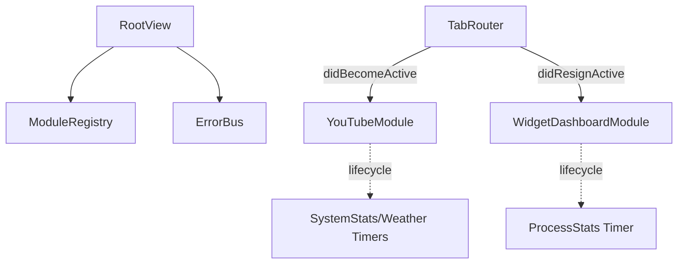

# EdgeLauncher Polish — Design Spec

- 작성일: 2026-05-15
- 작성자: jongyoungpark
- 상태: 초안 (사용자 검토 후 implementation plan)

## 1. 목적

EdgeLauncher MVP + Phase 2 모듈이 안착한 시점에서, 사용자 가치 큰 4가지 영역을 정리한다.

1. 성능·메모리 회수 (WKWebView lazy load, Timer suspend)
2. 코드 품질 정리 (큰 파일 분리, 미사용 코드 제거)
3. UX 누락 메우기 (단축키, 모듈 순서·표시 토글, 풀스크린 헤더 숨김, 터치 스크롤)
4. 신뢰성·테스트 (Phase 2 모듈 테스트, 통합 로깅)

Phase 3 신기능(메뉴바 아이콘, 자동 순환, 포모도로, 글로벌 Now Playing, 추가 webview)은 별도 spec.

## 2. 성능·메모리

### 2.1 WKWebView lazy load

- 현재: `ZStack { ForEach(registry.modules) }` 가 7개 모듈 뷰를 동시에 생성. 모든 WKWebView가 시작 직후 인스턴스화되어 도메인 로딩 → 메모리 다중 GB.
- 변경: `LazyOnAppear` 래퍼를 도입. 활성화된 적이 있는 모듈만 ZStack에 등록한다. 이미 활성화된 모듈은 비활성이어도 살아있어 백그라운드 재생 유지.
- 구현: `RootView` 에 `activated: Set<String>` 상태. `router.activate(id)` 호출 시 `activated.insert(id)`. ZStack에는 `registry.modules.filter { activated.contains($0.id) }` 만 렌더링.

### 2.2 Module lifecycle 훅

- `EdgeModule` 프로토콜에 옵션 메서드를 더한다:
  ```swift
  protocol EdgeModule {
      ...
      func didBecomeActive()
      func didResignActive()
  }
  extension EdgeModule {
      func didBecomeActive() {}
      func didResignActive() {}
  }
  ```
- `AnyEdgeModule` 도 두 콜백을 forwarding.
- `TabRouter` 가 activeID 변경 시 이전·새 모듈에 콜백 호출.
- SystemMonitorModule, WidgetDashboardModule 의 ObservableObject(SystemStats, ProcessStats, WeatherService) 가 콜백을 받아 Timer를 stop/start.

### 2.3 큰 파일 분리

- `WidgetDashboardView` 389줄 → 다음 4개로 쪼개기.
  - `ClockHero.swift` (시계 + 날짜 + 진행률 pill)
  - `WeatherPanel.swift`
  - `OutlookPanel.swift`
  - `RemindersPanel.swift`
  - `WidgetDashboardView.swift` 자체는 컨테이너로 70줄 이하.
- `SystemMonitorView` 222줄 → `Sparkline.swift` 와 `ProcessColumn.swift` 를 별도 파일로 분리.

### 2.4 미사용 코드 제거

- `Core/Media/NowPlayingBridge.swift` 삭제 (사용 안 함).
- `Modules/Ambient/` 디렉토리 삭제 (registry 미등록 상태).

## 3. 터치 스크롤

### 3.1 컴포넌트

`Core/Touch/TouchScrollContainer.swift`

```swift
struct TouchScrollContainer<Content: View>: NSViewRepresentable {
    let content: Content
    init(@ViewBuilder _ content: () -> Content) { self.content = content() }

    func makeNSView(context: Context) -> NSScrollView {
        let scrollView = NSScrollView()
        let hosting = NSHostingView(rootView: content)
        scrollView.documentView = hosting
        scrollView.hasVerticalScroller = false
        scrollView.drawsBackground = false
        scrollView.scrollerStyle = .overlay
        TouchPanGestureInstaller.install(on: scrollView)
        return scrollView
    }

    func updateNSView(_ nsView: NSScrollView, context: Context) {
        if let host = nsView.documentView as? NSHostingView<Content> {
            host.rootView = content
        }
    }
}
```

`TouchPanGestureInstaller`:
- 자체 `NSView` 서브클래스가 NSScrollView 위에 transparent overlay로 깔린다.
- `acceptsTouchEvents = true`, `allowedTouchTypes = [.direct]`.
- `touchesBegan/Moved/Ended` 에서 NSTouch.phase 추적, delta y 합산.
- `scrollView.contentView.scroll(to:)` 로 offset 변경.
- 관성 스크롤은 `CADisplayLink` 없이 simple decay 모델 (velocity * 0.95 per frame, < 0.5 stop).

### 3.2 적용 위치

- `Sidebar` 의 모듈 목록 ScrollView를 `TouchScrollContainer` 로 교체.
- WebView 모듈은 자체 터치 핸들링이 있어 wrap 안 함.

## 4. UX 누락

### 4.1 키보드 단축키

- `EdgeLauncherApp.body` 의 메뉴 커맨드에서 `CommandGroup(replacing: .windowList)` 으로 탭 단축키 추가.
- `.keyboardShortcut("1", modifiers: .command)` 부터 N까지 (모듈 수 만큼). 단축키 처리는 `TabRouter.activate(id)` 호출.
- `Cmd+R` 활성 모듈 새로고침 (WKWebView 가 있는 모듈은 reload).
- `Cmd+,` 는 기본 Settings 단축키 유지.
- `Cmd+K` 명령 팔레트는 spec 범위 밖 (Phase 3 후보).

### 4.2 모듈 순서 변경

- `ModuleRegistry.reorder(from:to:)` 메서드 추가.
- 사이드바 모듈 버튼에 `.onDrag` + `.onDrop(of:)` 적용. macOS 14의 `DropDelegate` 사용.
- 순서를 `[String]` (id 배열) 형태로 `UserDefaults` (`app.moduleOrder`) 에 영속.
- AppEnvironment.init 후 저장된 순서대로 모듈을 정렬.

### 4.3 모듈 표시 토글

- `ModuleRegistry` 에 `visibleIDs: Set<String>` 추가. 기본은 전체 표시.
- Settings의 "탭" 탭에 체크박스 리스트. 토글 시 UserDefaults `app.moduleHidden` (Set<String> JSON) 갱신.
- 사이드바는 `visibleIDs` 에 포함된 모듈만 렌더링.

### 4.4 풀스크린 시 헤더·사이드바 자동 숨김

- `RootView` 에 `@State private var chromeVisible: Bool`.
- 풀스크린 진입 시 `chromeVisible = false`. 마우스 이동 감지로 fade-in/out (3초 idle).
- 풀스크린은 `NSWindow.didEnterFullScreenNotification` 으로 감지.

### 4.5 에러 배너

- `ErrorBanner` 컴포넌트 (상단 노란 줄, 닫기 버튼).
- 전역 `ErrorBus`(@MainActor singleton)에 publish. RootView 가 구독.
- WeatherService / EventStoreVM / LauncherStore 의 `errorMessage` 를 ErrorBus로 라우팅.

## 5. 신뢰성·테스트

### 5.1 통합 로깅

- `Core/Log/AppLog.swift`:
  ```swift
  enum AppLog {
      static let weather = Logger(subsystem: "com.jongyoungpark.edgelauncher", category: "weather")
      static let event = Logger(subsystem: ..., category: "event")
      static let launcher = Logger(subsystem: ..., category: "launcher")
      static let monitor = Logger(subsystem: ..., category: "monitor")
      static let app = Logger(subsystem: ..., category: "app")
  }
  ```
- 기존 print/주석을 `AppLog.<category>.error(...)` 또는 `.debug(...)` 로 교체.

### 5.2 테스트 보강

- `SystemMonitorModuleTests`: 메타데이터.
- `WidgetDashboardModuleTests`: 메타데이터.
- `MessengerModuleTests`: 메타데이터 + `Coordinator.parseUnread("(5) Discord")` 단위 테스트.
- `LauncherStoreTests`: add/remove/dedup 동작.
- 목표: 단위 테스트 14개 → 22개 이상.

## 6. 비대상

- Phase 3: 메뉴바 아이콘, 위젯 자동 순환, 포모도로, 글로벌 Now Playing 컨트롤, Slack/Notion/ChatGPT/Claude 추가 webview.
- WeatherKit 전환, 네이버 reverse geocoding 도입.

## 7. 모듈 아키텍처 변경



## 8. 호환성 및 위험

- **TouchScrollContainer**: macOS 14 의 NSTouch direct 이벤트 지원. Xeneon Edge 실기기에서 검증 필요.
- **단축키 충돌**: 모듈 6~10개면 Cmd+1..N 까지만 사용 (10 초과 시 단축키 미할당).
- **모듈 lifecycle**: `didBecomeActive/Resign` 가 매 탭 전환 시 호출. 무거운 작업 들어가지 않도록 주의.
- **AppLog**: macOS Logger 는 콘솔에서 확인 가능. release 빌드에서 `private` 캡쳐 마스킹 처리.

## 9. 테스트 전략

- 단위 테스트: 신규 4개 모듈 메타데이터 + LauncherStore + Discord parser.
- 통합 테스트: ModuleRegistry.reorder, lifecycle 호출 순서.
- 수동 검증: 사이드바 터치 스크롤, 풀스크린 chrome 자동 숨김, 단축키 동작.

## 10. 미해결 사항

1. 풀스크린 chrome 자동 숨김 시 마우스 hover 감지 영역 (윈도우 전체? 상단/좌측 가장자리?)
2. TouchScrollContainer 의 관성 모델 — `CGSScrollWheelEventData` 기반? 자체 decay?
3. 모듈 표시 토글로 0개가 되면? (placeholder 표시 + 모두 다시 보이기 버튼)
