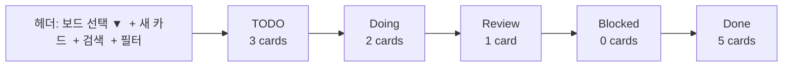

# 칸반 보드 모듈 설계

**작성일**: 2026-05-15
**모듈 ID**: `kanban`
**상태**: spec

## 1. 목적

32:9 와이드 디스플레이에서 가로로 펼친 칸반 보드로 작업 흐름을 한눈에 본다. 4~6 컬럼이 동시에 보이고, 멀티터치로 카드를 드래그&드롭한다. Trello/Notion/Linear 의존성 없이 로컬에서 작동한다.

## 2. UX 컨셉



- **컬럼 폭**: 가변, 사용자가 드래그로 조절 (기본 380pt)
- **컬럼 개수**: 사용자 정의 (기본 5개)
- **카드**: 제목 + 라벨(태그) + 마감일 + 색상 스트라이프 + 진행률
- **빈 컬럼**: "여기로 카드를 끌어오세요" placeholder
- **헤더**: 보드 전환, 카드 검색, 라벨 필터, 보기 모드 (compact/standard/expanded)

## 3. 카드 데이터 모델

```swift
struct KanbanBoard: Codable, Identifiable {
    let id: UUID
    var name: String
    var color: String
    var columns: [KanbanColumn]
    var labels: [KanbanLabel]
    var createdAt: Date
    var updatedAt: Date
}

struct KanbanColumn: Codable, Identifiable {
    let id: UUID
    var name: String
    var color: String?
    var wipLimit: Int?           // 카드 개수 제한
    var cards: [KanbanCard]
    var collapsed: Bool
}

struct KanbanCard: Codable, Identifiable {
    let id: UUID
    var title: String
    var notes: String?           // markdown
    var labelIds: [UUID]
    var dueDate: Date?
    var checklist: [ChecklistItem]
    var attachments: [Attachment]
    var color: String?
    var assignee: String?
    var createdAt: Date
    var updatedAt: Date
    var completedAt: Date?
}

struct KanbanLabel: Codable, Identifiable {
    let id: UUID
    var name: String
    var color: String
}

struct ChecklistItem: Codable, Identifiable {
    let id: UUID
    var text: String
    var done: Bool
}
```

## 4. 인터랙션

| 입력 | 동작 |
|---|---|
| 카드 탭 | 상세 패널 열기 (우측 슬라이드 인) |
| 카드 길게 누름 + 드래그 | 컬럼 간 이동, 컬럼 내 순서 변경 |
| 카드 좌측 스와이프 | 완료 처리 (Done 으로 이동) |
| 카드 우측 스와이프 | 컨텍스트 메뉴 (라벨/마감일/삭제) |
| 컬럼 헤더 더블탭 | 컬럼명 인라인 편집 |
| 빈 영역 길게 누름 | 새 카드 |
| 보드 전환 | 헤더 드롭다운 또는 Cmd+1..9 |

## 5. 단축키

| 키 | 동작 |
|---|---|
| Cmd+N | 새 카드 (현재 활성 컬럼) |
| Cmd+Shift+N | 새 보드 |
| Cmd+F | 검색 활성화 |
| Cmd+E | 활성 카드 편집 |
| Cmd+Delete | 활성 카드 삭제 (휴지통) |
| Cmd+Z / Shift+Cmd+Z | undo/redo |
| 방향키 | 카드 포커스 이동 |

## 6. 저장·동기화

- 위치: `~/Library/Application Support/EdgeLauncher/kanban/<boardId>.json`
- 인덱스: `boards.json` (보드 메타데이터 목록)
- 자동 저장: 변경 시 debounce 800ms
- 휴지통: `kanban/.trash/<boardId>/<cardId>.json` 30일 보관 후 자동 삭제
- 백업: 매일 1회 `kanban/.snapshots/YYYY-MM-DD/` 압축
- 외부 동기화: v3에서 iCloud Drive 옵션 (Documents 위치)

## 7. 32:9 폼팩터 최적화

| 기능 | 효과 |
|---|---|
| 5개 컬럼 동시 표시 (380pt × 5) | 좌우 스크롤 없이 전체 흐름 |
| 카드 횡 정렬 (compact 모드) | 한 화면에 30개 이상 카드 |
| 컬럼별 sparkline 인디케이터 | 7일간 카드 변화 미니 차트 (상단 12pt) |
| 가로 스와이프로 컬럼 페이지네이션 | 컬럼이 6개 넘으면 |

## 8. EdgeModule 통합

```swift
struct KanbanModule: EdgeModule {
    let id = "kanban"
    let title = "Kanban"
    let iconName = "rectangle.split.3x1.fill"
    let supportsFullscreen = true

    var view: some View { KanbanBoardView() }

    func didBecomeActive() { /* 보드 store 로드 */ }
    func didResignActive() { /* 진행 중 편집 flush */ }
}
```

## 9. 라벨·필터 시스템

- 라벨: 보드 단위, 색상 + 이름 (예: bug, feature, urgent)
- 카드 1개에 라벨 N개
- 필터:
  - 라벨 (다중 선택, AND/OR 토글)
  - 마감일 (오늘 / 이번주 / 지연 / 무기한)
  - 담당자
  - 검색어 (제목 + 노트 풀텍스트)
- 필터 상태는 보드별 마지막값 저장

## 10. 가져오기/내보내기

| 포맷 | 임포트 | 익스포트 |
|---|---|---|
| JSON (네이티브) | O | O |
| Markdown (보드 → 컬럼 → 카드) | O (역방향) | O |
| Trello JSON | O | X |
| CSV (카드 한 줄씩) | O | O |

## 11. 단계별 구현

| Phase | 범위 |
|---|---|
| **P1 (MVP)** | 단일 보드, 컬럼/카드 CRUD, 드래그&드롭, 로컬 저장 |
| **P2** | 다중 보드, 라벨, 마감일, 검색, undo/redo |
| **P3** | 체크리스트, 첨부, 휴지통, 백업 |
| **P4** | 필터, 외부 임포트, sparkline, WIP 제한 경고 |
| **P5** | iCloud 동기화, 칸반 → 캘린더(타임라인) 연동 |

## 12. 테스트 전략

- `KanbanStore` 단위 테스트: CRUD, 이동, undo, 저장/로드, 마이그레이션
- `KanbanFilter` 단위 테스트: 라벨/날짜/검색 조합
- UI 테스트: 드래그&드롭, 컬럼 추가/삭제, 보드 전환
- 통합: 1000+ 카드 보드에서 스크롤/검색 성능

## 13. 비목표

- 실시간 협업 (CRDT, WebSocket)
- 권한 관리, 코멘트, 멘션
- 간트 차트 뷰 (v2 후보)
- 자동화 룰 (if-this-then-that)
