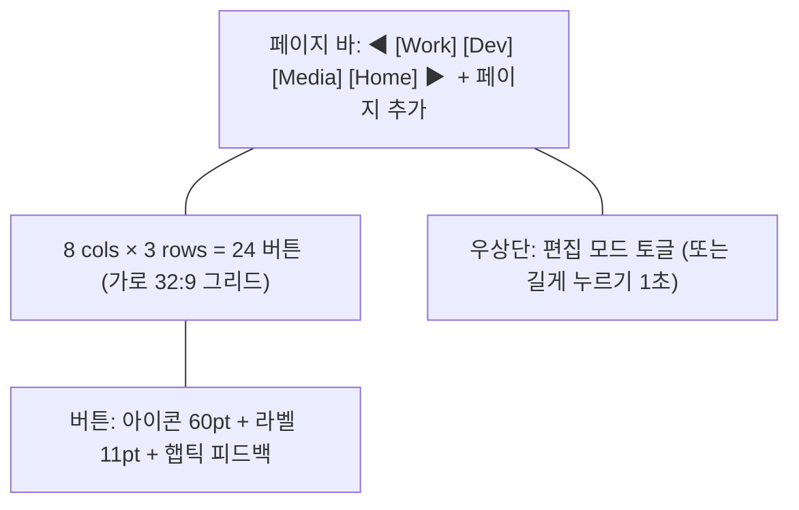

# Stream Deck 패드 모듈 설계

**작성일**: 2026-05-15
**모듈 ID**: `streamdeck`
**상태**: spec

## 1. 목적

32:9 멀티터치 디스플레이를 거대한 매크로 패드로 활용한다. 큰 터치 타겟의 그리드 버튼으로 앱 실행, 단축키 발사, 셸 명령 실행, AI 프롬프트 트리거를 한 손가락 탭으로 수행한다.

## 2. UX 컨셉



- **기본 그리드**: 8 × 3 = 24 버튼. 사용자가 4×2 ~ 12×4 사이로 조정 가능
- **버튼 크기**: 최소 88pt × 88pt (Apple HIG 터치 타겟 기준 초과)
- **페이지 시스템**: 좌/우 스와이프로 페이지 전환, 페이지명 + 색상 테마
- **편집 모드**: 길게 누르면 wiggle 애니메이션 + 삭제 X 표시 (iOS 홈스크린 스타일)
- **빈 슬롯**: 점선 보더, 탭하면 액션 추가 시트

## 3. 액션 타입

| 타입 | 설명 | 예시 |
|---|---|---|
| `launchApp` | macOS 앱 실행 | Xcode, Slack, Notion |
| `openURL` | URL 열기 | GitHub PR 페이지, 사내 위키 |
| `runShell` | 셸 명령 실행 (백그라운드) | `git pull`, `make deploy` |
| `keystroke` | 키보드 단축키 발사 | Cmd+Shift+P, Cmd+Tab |
| `appleScript` | AppleScript 실행 | Things 3 새 할일, OmniFocus |
| `pasteText` | 클립보드 텍스트 삽입 | 자주 쓰는 이메일 서명 |
| `webhook` | HTTP POST 호출 | Slack 메시지, Notion API |
| `aiPrompt` | AI CLI 호출 | `claude -p "..."`, `codex ask` |
| `multi` | 위 액션들의 순차 실행 | 미팅 시작 매크로 |

## 4. 데이터 모델

```swift
struct StreamDeckPage: Codable, Identifiable {
    let id: UUID
    var name: String
    var color: String        // hex
    var buttons: [StreamDeckButton]
}

struct StreamDeckButton: Codable, Identifiable {
    let id: UUID
    var position: GridPosition    // row, col
    var label: String
    var iconType: IconType        // sfsymbol / emoji / image / appIcon
    var iconValue: String
    var background: String        // hex
    var foreground: String        // hex
    var action: StreamDeckAction
}

enum StreamDeckAction: Codable {
    case launchApp(bundleId: String)
    case openURL(URL)
    case runShell(command: String, args: [String])
    case keystroke(modifiers: [Modifier], key: String)
    case appleScript(source: String)
    case pasteText(String)
    case webhook(url: URL, method: String, body: String?)
    case aiPrompt(provider: AIProvider, prompt: String)
    case multi([StreamDeckAction])
}
```

## 5. 저장

- 파일: `~/Library/Application Support/EdgeLauncher/streamdeck.json`
- 자동 저장: 변경 시 debounce 500ms 후 디스크 flush
- 백업: 저장 직전 `streamdeck.json.bak` 로 회전
- iCloud Drive 동기화는 v2 (Documents 위치 옵션)

## 6. EdgeModule 통합

```swift
struct StreamDeckModule: EdgeModule {
    let id = "streamdeck"
    let title = "Pad"
    let iconName = "square.grid.3x3.fill"
    let supportsFullscreen = true

    var view: some View { StreamDeckView() }

    func didBecomeActive() { /* 햅틱 엔진 prewarm */ }
    func didResignActive() { /* 진행 중 액션 취소 */ }
}
```

## 7. 보안·권한

| 액션 | 필요 권한 | 처리 |
|---|---|---|
| `keystroke` | Accessibility | 첫 사용 시 시스템 설정 안내 |
| `appleScript` | Automation | 대상 앱별 동의 필요 |
| `runShell` | 없음 (사용자 권한) | 실행 전 confirm 토글 옵션 |
| `webhook` | 없음 | URL 화이트리스트 옵션 |
| `aiPrompt` | API 키 | Keychain 저장, 평문 노출 금지 |

## 8. 단축키·제스처

| 입력 | 동작 |
|---|---|
| 버튼 탭 | 액션 실행 + 햅틱 + 0.3s 글로우 |
| 버튼 길게 누름 (1s) | 편집 모드 진입 |
| 페이지 좌/우 스와이프 | 페이지 전환 |
| Cmd+E | 편집 모드 토글 |
| Cmd+1..9 | 페이지 1~9 직행 |
| Cmd+N | 새 페이지 |

## 9. 단계별 구현

| Phase | 범위 |
|---|---|
| **P1 (MVP)** | 그리드, `launchApp`/`openURL`/`keystroke`, 단일 페이지, 편집 모드 |
| **P2** | 다중 페이지, `runShell`/`appleScript`/`pasteText`, 햅틱 |
| **P3** | `webhook`/`aiPrompt`, 다중 액션 (`multi`), 아이콘 라이브러리 |
| **P4** | 임포트/익스포트 (JSON 공유), iCloud 동기화 |

## 10. 테스트 전략

- `StreamDeckStore` 단위 테스트: CRUD, 순서 변경, 저장/로드, 마이그레이션
- `ActionExecutor` 단위 테스트: 각 액션 타입 mock 실행
- UI 테스트: 편집 모드 진입/이탈, 페이지 스와이프
- 통합: 실제 앱 launch, URL open, keystroke 동작 검증 (수동)

## 11. 비목표

- 물리 Stream Deck 디바이스 연동 (별도 모듈)
- 매크로 녹화/재생 (v2 후보)
- 클라우드 공유 마켓플레이스
