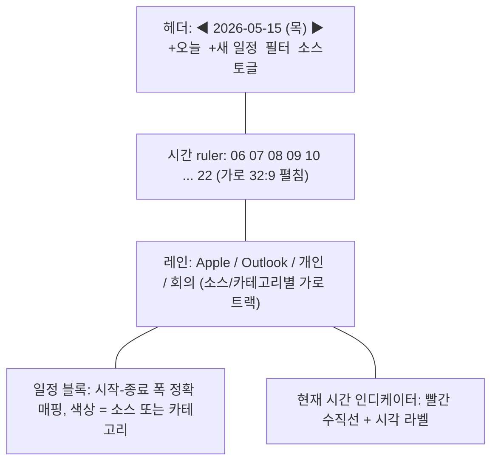
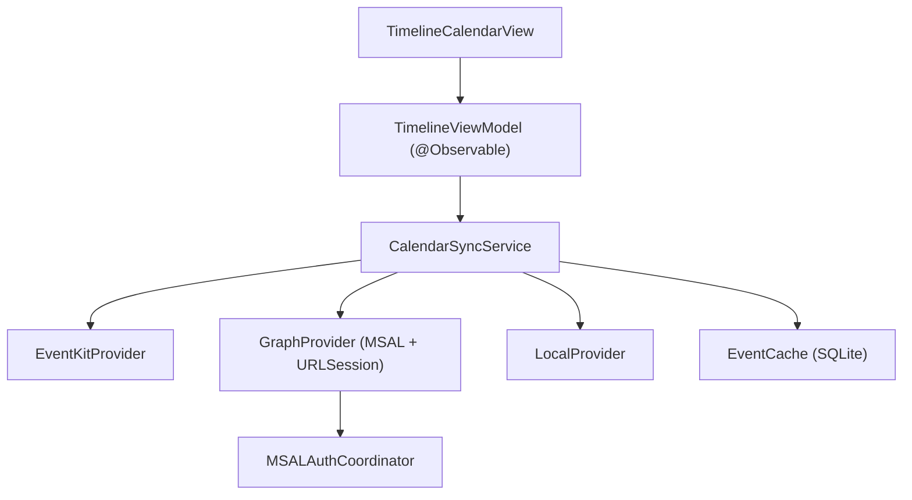

# 타임라인 캘린더 모듈 설계

**작성일**: 2026-05-15
**모듈 ID**: `timeline`
**상태**: spec

## 1. 목적

32:9 와이드 디스플레이의 가로축을 시간축으로 활용한다. 오늘(또는 임의 날짜)의 일정을 가로 timeline 한 줄로 펼쳐 전체 하루를 한눈에 본다. Apple Calendar(EventKit) 와 Microsoft 365(Outlook) 일정을 동시에 표시하고, 직접 추가·수정·삭제한다.

기존 Widgets 탭의 작은 캘린더 위젯과는 별개의 풀스크린 모듈.

## 2. UX 컨셉



- **시간 범위**: 기본 06:00 ~ 22:00 (16시간), 사용자가 24시간 풀로 확장 가능
- **가로 폭**: 32:9 디스플레이 컨텐츠 영역 ≒ 2370pt → 시간당 약 148pt
- **레인 구분**: 소스(Apple/Outlook)별 또는 캘린더별 가로 트랙
- **현재 시간**: 빨간 수직선 + 자동 스크롤 (옵션)
- **종일 일정**: 상단 별도 띠 영역
- **확대/축소**: 핀치 줌으로 시간 ruler 확대 (시간당 폭 변경)

## 3. 데이터 소스

| 소스 | 프레임워크 | 권한 |
|---|---|---|
| Apple Calendar (로컬·iCloud·Google·Exchange 등록된 모든 계정) | EventKit | `NSCalendarsFullAccessUsageDescription` |
| Microsoft 365 (Outlook) | Microsoft Graph + MSAL | Azure AD 앱 등록 + `Calendars.ReadWrite`, `Calendars.ReadWrite.Shared` |
| 로컬 전용 EdgeLauncher 일정 | 자체 JSON | 없음 |

## 4. 데이터 모델

```swift
enum CalendarSource: Codable, Hashable {
    case apple(calendarId: String)
    case outlook(calendarId: String, tenantId: String)
    case local(boardId: UUID)        // 칸반 카드의 dueDate 매핑 옵션
}

struct TimelineEvent: Codable, Identifiable {
    let id: String                   // EventKit eventIdentifier 또는 Graph eventId
    var source: CalendarSource
    var title: String
    var notes: String?
    var location: String?
    var start: Date
    var end: Date
    var isAllDay: Bool
    var attendees: [Attendee]
    var color: String?
    var recurrence: RecurrenceRule?
    var lastModified: Date
    var url: URL?                    // Teams/Zoom/Meet 링크
}

struct Attendee: Codable, Hashable {
    var name: String
    var email: String
    var response: ResponseStatus     // accepted/tentative/declined/needsAction
    var isOrganizer: Bool
}
```

## 5. 인터랙션

| 입력 | 동작 |
|---|---|
| 일정 블록 탭 | 우측 상세 패널 열기 (제목·시간·참석자·노트·링크) |
| 일정 블록 더블탭 | 인라인 편집 (제목) |
| 일정 블록 길게 누름 + 드래그 (좌/우) | 시간 이동 |
| 일정 블록 가장자리 드래그 | 시작/종료 시간 조정 |
| 빈 영역 길게 누름 | 새 일정 (해당 시간으로) |
| 헤더 날짜 탭 | 미니 달력 popover, 점프 |
| 좌/우 스와이프 (헤더 영역) | 전날/다음날 |
| 핀치 인/아웃 | 시간 ruler 줌 |
| 좌상단 ↻ | 강제 새로고침 (Apple + Graph) |

## 6. 단축키

| 키 | 동작 |
|---|---|
| Cmd+T | 오늘로 |
| Cmd+← / Cmd+→ | 전날 / 다음날 |
| Cmd+N | 새 일정 |
| Cmd+R | 새로고침 |
| Cmd+F | 일정 제목 검색 |
| Cmd+1..9 | 소스 토글 (1:Apple, 2:Outlook, 3:Local, ...) |

## 7. 권한·인증

### Apple Calendar (EventKit)
- 첫 진입 시 `EKEventStore.requestFullAccessToEvents` 호출
- Info.plist: `NSCalendarsFullAccessUsageDescription`
- 거부 시 onboarding 화면에서 시스템 설정 안내

### Microsoft 365 (MSAL)
- Azure AD 앱 등록 후 Client ID / Tenant ID 주입 (Info.plist 또는 빌드 설정)
- 권한 스코프: `User.Read`, `Calendars.ReadWrite`, `Calendars.ReadWrite.Shared`, `offline_access`
- Authorization Code + PKCE 플로우
- 토큰 저장: macOS Keychain (`kSecAttrAccessibleWhenUnlockedThisDeviceOnly`)
- Refresh Token 으로 백그라운드 갱신
- 로그아웃: Keychain 삭제 + MSAL cache clear

자세한 인프라 요청 사항은 [docs/azure-ad-request.md](../../azure-ad-request.md) 참조.

## 8. 동기화 전략

| 시점 | 동작 |
|---|---|
| 모듈 활성화 (`didBecomeActive`) | 캐시 즉시 표시 + 백그라운드 fetch |
| 주기적 (5분) | Apple: `EKEventStoreChanged` 알림 / Outlook: delta query (`/me/calendarView/delta`) |
| 사용자 새로고침 | 양쪽 강제 fetch |
| 일정 수정 후 | 낙관적 UI 업데이트 + 서버 응답 reconcile |
| 네트워크 단절 | 캐시 표시 + 노란 ! 인디케이터 |

- 캐시: SQLite 또는 Core Data, 14일 이전·30일 이후 prune
- Delta token 보관으로 변경분만 받기 (Graph 권장 방식)
- 충돌 처리: 서버 lastModified > 로컬 → 서버 우선, 사용자에게 토스트 알림

## 9. 32:9 폼팩터 최적화

| 기능 | 설명 |
|---|---|
| 가로 ruler 16시간 풀 표시 | 시간당 약 148pt (스크롤 없이 하루 전체) |
| 멀티 레인 (소스/캘린더별 트랙) | 세로로 쌓이지 않고 가로 trackbar |
| 시간 사이 빈 슬롯 표시 | 회색 호버, 탭으로 즉시 일정 추가 |
| 회의 충돌 시각화 | 겹치는 시간은 빨간 보더 + ! 아이콘 |
| 통근/이동 시간 표시 | 일정에 location 있으면 Apple Maps ETA |

## 10. EdgeModule 통합

```swift
struct TimelineCalendarModule: EdgeModule {
    let id = "timeline"
    let title = "Timeline"
    let iconName = "calendar.day.timeline.left"
    let supportsFullscreen = true

    var view: some View { TimelineCalendarView() }

    func didBecomeActive() {
        CalendarSyncService.shared.start()
    }

    func didResignActive() {
        CalendarSyncService.shared.pause()
    }
}
```

## 11. 컴포넌트 구조



## 12. 단계별 구현

| Phase | 범위 |
|---|---|
| **P1 (MVP)** | EventKit 통합, 가로 ruler, 일정 블록 렌더, 읽기만 |
| **P2** | 일정 추가/수정/삭제 (Apple Calendar), 드래그로 시간 이동 |
| **P3** | MSAL 통합, Outlook 일정 읽기, 멀티 레인 |
| **P4** | Outlook 일정 쓰기, delta 동기화, 종일 일정 띠 |
| **P5** | 회의 충돌 시각화, 통근 시간, 핀치 줌, 검색 |
| **P6** | 로컬 EdgeLauncher 일정 (칸반 카드 dueDate 연동) |

## 13. 테스트 전략

- `TimelineViewModel` 단위 테스트: 일정 정렬, 레인 배치, 충돌 감지
- `EventKitProvider` 단위 테스트: 권한 거부/허용 시나리오 mock
- `GraphProvider` 단위 테스트: MSAL mock, 토큰 갱신, 401 재시도
- `EventCache` 단위 테스트: delta merge, prune, 마이그레이션
- UI 테스트: 일정 드래그, 새 일정 모달, 날짜 점프
- 통합: 실제 Apple Calendar 계정 + Outlook 테스트 계정

## 14. 보안

- Microsoft 토큰: Keychain (`kSecAttrAccessibleWhenUnlockedThisDeviceOnly`)
- 일정 본문 노트는 Keychain 미저장 (메모리/캐시만)
- 로그 출력 시 토큰/이메일/제목 마스킹
- 외부 송신: Microsoft Graph 엔드포인트로만, 사내 서버 경유 없음

## 15. 비목표

- 일정 검색 엔진 (자체) — Apple Spotlight·Graph 검색 위임
- 회의 자동 스케줄링 (free/busy 분석)
- 다른 사람 캘린더 공유 관리 UI (v2)
- 캘린더 동기화 충돌 머지 UI (서버 우선 정책 유지)
