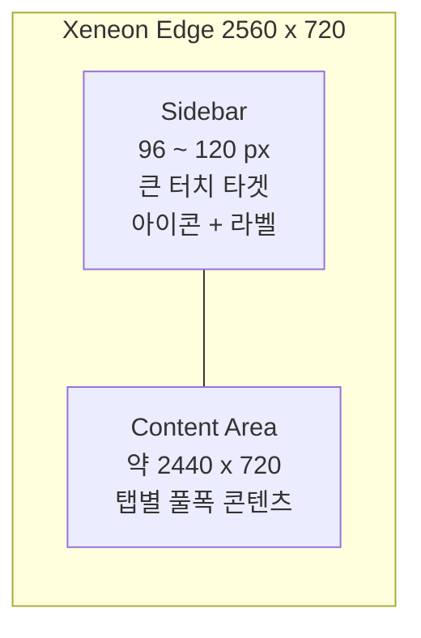
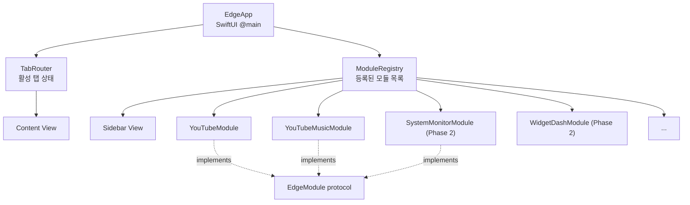

# Xeneon Edge Launcher — Design Spec

- 작성일: 2026-05-15
- 작성자: jongyoungpark
- 상태: 초안 (사용자 검토 대기)

## 1. 한 줄 컨셉

Corsair Xeneon Edge(14.5", 2560x720, 32:9, 멀티터치)를 위한 macOS 네이티브 런처 앱. 좌측 사이드바에서 기능을 골라 32:9 풀폭으로 사용한다. 첫 모듈은 YouTube, YouTube Music이며, 이후 시스템 모니터·위젯 대시보드 등을 모듈로 확장한다.

## 2. 사용 시나리오

- **혼합 모드**: 메인 모니터 옆에 두고 상황에 따라 미디어 / 모니터링 / 위젯 / 앰비언트 모드로 탭 전환.
- **터치 퍼스트**: 사이드바 탭과 주요 컨트롤은 손가락으로 동작 가능. 키보드/마우스는 보조.
- **풀스크린**: 앱 윈도우를 Xeneon Edge 디스플레이에 풀스크린으로 띄워 2560x720을 정확히 채움.

## 3. 기술 스택

| 항목 | 선택 | 이유 |
|---|---|---|
| 타깃 OS | macOS 14 Sonoma 이상 | NavigationSplitView, 최신 SwiftUI 활용 |
| UI | SwiftUI + AppKit interop | 네이티브, 터치 친화, 빠른 개발 |
| 웹 컴포넌트 | WKWebView | YouTube, YouTube Music 임베드 |
| 미디어 | AVKit, MediaPlayer (Now Playing) | 미디어 키 연동 |
| 모듈화 | EdgeModule 프로토콜 + ModuleRegistry | 새 탭을 모듈로 추가 |
| 상태 저장 | @AppStorage, UserDefaults | 모듈별 키 네임스페이스 |
| 디스플레이 감지 | NSScreen | Xeneon Edge 자동 감지 및 윈도우 이동 |

**WKWebView를 선택한 이유**: YouTube, YouTube Music은 공식 macOS 앱 및 SDK가 없다. YouTube Data API는 광고 포함 정상 재생을 보장하지 않으므로, 본인 사용 목적에서는 웹 임베드가 가장 안정적이고 빠른 경로다. 한계는 광고가 그대로 노출되고, 단축키·터치 제스처는 자바스크립트 인젝션으로 보강해야 한다는 점.

## 4. 레이아웃 (2560x720)



| 요소 | 값 | 비고 |
|---|---|---|
| 사이드바 폭 | 96 ~ 120 px (접을 때 64) | 손가락 터치 최소 44 px 보장 |
| 탭 아이콘 크기 | 56 x 56 px | 라벨 11 pt 아래에 표시 |
| 사이드바 상단 | 앱 로고, 검색 입력 | |
| 사이드바 하단 | 설정, 풀스크린 토글, Edge 전환 | |
| 컨텐츠 높이 | 720 px 고정 | 16:9 영상이면 가운데 1280 x 720, 좌우 580 px씩 보조 패널 가능 |

## 5. MVP 범위

1. **공통 인프라**
   - 좌측 사이드바 UI, 탭 라우팅
   - EdgeModule 프로토콜, ModuleRegistry
   - 환경설정 윈도우 (기본 탭, 풀스크린 자동 여부 등)
   - Xeneon Edge 디스플레이 자동 감지 및 윈도우 이동 (옵션)

2. **YouTube 탭**
   - WKWebView로 youtube.com 임베드
   - 터치 제스처: 더블탭 좌/우 = 10초 점프, 두 손가락 탭 = 일시정지
   - 자동 PiP 진입, 풀스크린 버튼
   - 쿠키 영속화로 로그인 유지

3. **YouTube Music 탭**
   - WKWebView로 music.youtube.com 임베드
   - 미디어 키(재생/일시정지/이전/다음) 연동
   - macOS Now Playing 위젯에 현재 곡 정보 노출

## 6. Phase 2 모듈 (선정된 카테고리)

| 모듈 | 핵심 가치 | 32:9 적합도 |
|---|---|---|
| 시스템 모니터 | CPU/GPU/RAM/네트워크 가로 시계열 그래프 | 매우 높음 (가로로 긴 그래프) |
| 위젯 대시보드 | 시계 + 날씨 + 캘린더 + 할일 가로 배치 | 높음 |
| 메신저 사이드 패널 | Slack/Discord/iMessage/Mail 미읽음 통합 | 중간 |
| 런처/컨트롤 | 클립보드 히스토리, AI 채팅(Claude/ChatGPT) | 높음 (터치 퍼스트와 결합) |
| 앰비언트 | 디지털 액자, 풀스크린 시계, 음악 비주얼라이저 | 매우 높음 |

각 모듈은 별도 작업 단위로 분리하여 순차 개발한다. MVP 검수 이후 우선순위를 다시 정한다.

## 7. 모듈 아키텍처



**EdgeModule 프로토콜 (의사 코드)**

```swift
protocol EdgeModule {
    var id: String { get }                 // 예: "youtube"
    var title: String { get }              // 예: "YouTube"
    var icon: Image { get }                // SF Symbol or asset
    var supportsFullscreen: Bool { get }
    @ViewBuilder var view: AnyView { get } // 컨텐츠 뷰
}
```

새 탭 추가 절차: `EdgeModule`을 구현하고 `ModuleRegistry.register(_:)` 한 줄. 사이드바는 등록된 모듈을 자동 렌더링한다.

## 8. 데이터와 상태

- **앱 전역 설정**: `@AppStorage`. 키 네임스페이스 `app.*`.
- **모듈별 설정**: `UserDefaults`. 키 네임스페이스 `module.<id>.*`.
- **모듈 간 통신**: MVP에서는 의도적으로 없음. 필요해질 때 도입(YAGNI).
- **WebView 쿠키 영속화**: 공유 `WKWebsiteDataStore` 사용해 로그인 유지.
- **윈도우 위치**: 마지막 사용 화면 기억. Xeneon Edge 감지 시 자동 이동(설정으로 켜고 끌 수 있음).

## 9. 에러 및 엣지 케이스

| 상황 | 처리 |
|---|---|
| Xeneon Edge 미연결 | 일반 윈도우로 동작. 사이드바에 "Edge로 이동" 비활성 상태 표시 |
| YouTube/Music 로그인 끊김 | 쿠키 영속화로 1차 방어. 만료 시 웹뷰가 직접 로그인 페이지 노출 |
| 네트워크 단절 | 각 모듈 자체 에러 뷰 + 재시도 버튼 |
| 자동재생 차단 | `mediaTypesRequiringUserActionForPlayback = []` 로 우회 |
| 디스플레이 핫플러그 | NSScreen 변경 알림 수신, 사용자 설정에 따라 자동 이동 |

## 10. 비기능 요구사항

- **성능**: 탭 전환 200 ms 이내. 비활성 모듈은 렌더링 정지.
- **메모리**: 모든 모듈 합쳐 평상시 500 MB 이하 목표(WebView 2개 기준).
- **접근성**: VoiceOver 탭 라벨, Dynamic Type 사이드바 라벨.
- **터치 응답성**: 탭 hit 영역 최소 44 x 44 pt.

## 11. 보안과 프라이버시

- 마이크/카메라 권한 사용 없음 (MVP 기준).
- 외부 네트워크는 WKWebView가 처리하는 YouTube/YouTube Music 도메인뿐.
- Phase 2의 시스템 모니터 추가 시 Endpoint Security 등 권한 요건 별도 검토.

## 12. 테스트 전략

- **단위 테스트**: ModuleRegistry 등록/조회, 디스플레이 감지 로직, 설정 저장.
- **UI 테스트**: 사이드바 탭 전환, 풀스크린 토글, 모듈 초기 렌더링.
- **수동 검증**: 실제 Xeneon Edge에서 풀스크린, 터치 제스처, 미디어 키 연동.

## 13. 빌드 및 배포

- Xcode 프로젝트, Swift 패키지 매니저로 외부 의존성 관리.
- 코드 서명: 본인 사용 목적이므로 Developer ID 또는 Ad Hoc.
- 배포: MVP 단계에서는 본인 사용만, 추후 정리되면 깃허브 릴리스 또는 DMG.

## 14. 미해결 사항 (Open Questions)

1. YouTube/YouTube Music 페이지 자체 레이아웃을 32:9에 더 맞추도록 CSS 인젝션을 어디까지 할지 (MVP는 "그대로" 표시).
2. 사이드바 폭을 96 px와 120 px 중 어느 쪽으로 시작할지 (실기기 터치 테스트 후 결정).
3. 풀스크린 단축키 및 시스템 단축키 충돌 여부 (Cmd+Ctrl+F 등).

## 15. 변경 이력

- 2026-05-15: 최초 작성. YouTube + YouTube Music을 MVP로 확정, Phase 2 모듈 후보 5종(A 제외 B/C/D/F/G) 합의.
